# Notion Scraper - Architecture Document

> **Design Philosophy:** Reactive Event-Driven Micro-Kernel  
> **Version:** 5.1 — Academic Edition (Dark Theme Optimized) | December 3, 2025

---

## 1. System Overview

The Notion Scraper creates offline replicas of Notion sites through a **Master-Worker** distributed architecture. The Master orchestrates; Workers execute.

### 1.1 High-Level System Architecture


### 1.2 System Context Diagram (C4 Level 1)

> **Notation:** C4 System Context — shows the system boundary and external actors/systems.

```mermaid
---
config:
  theme: dark
  themeVariables:
    primaryColor: "#1e40af"
    primaryTextColor: "#e0f2fe"
    fontSize: "14px"
---
flowchart TB
    %% C4 LEVEL 1: System Context (Dark Theme)
    classDef person fill:#0891b2,stroke:#06b6d4,stroke-width:2px,color:#f0f9fa
    classDef system fill:#1e40af,stroke:#3b82f6,stroke-width:3px,color:#e0f2fe
    classDef external fill:#7c3aed,stroke:#a78bfa,stroke-width:2px,color:#ede9fe
    classDef database fill:#059669,stroke:#10b981,stroke-width:2px,color:#d1fae5
    
    subgraph ExternalSystems["EXTERNAL SYSTEMS"]
        direction LR
        Notion[("Notion Site\n──────────────\nnotion.site\n<<External API>>")]:::external
        FS[("Local Filesystem\n──────────────\nOutput Directory\n<<Storage>>")]:::database
    end
    
    subgraph SystemBoundary["NOTION RECURSIVE SCRAPER <<System>>"]
        direction TB
        Master["Master Process\n──────────────\n• Orchestration\n• State Management\n• Phase Coordination"]:::system
        Workers["Worker Pool\n──────────────\n• Browser Automation\n• Parallel Execution\n• Puppeteer Instances"]:::system
        
        Master <===>|"coordinate\n(IPC)"| Workers
    end
    
    User((\"USER<br/>──────────────<br/>Developer/<br/>Administrator\")):::person
    
    %% External Interactions
    User ==>|"1. Configure & Run"| Master
    Master -.->|"6. Display Progress"| User
    Workers ==>|"2. HTTP/HTTPS Requests"| Notion
    Notion -.->|"3. HTML/Assets"| Workers
    Workers ==>|"4. Write Files"| FS
    Master -.->|"5. Completion Report"| User
    
    %% Styling
    style ExternalSystems fill:#0f172a,stroke:#64748b,stroke-width:2px
    style SystemBoundary fill:#1e293b,stroke:#3b82f6,stroke-width:3px
```

### 1.3 Core Principles

| Principle | Description |
|-----------|-------------|
| **Master = Brain** | Decides what to do, tracks state, never does heavy work |
| **Worker = Muscle** | Executes tasks, stateless, isolated Puppeteer instance |
| **Event-Driven** | Components communicate via events, not polling |
| **Two-Phase** | Discovery (map site) → Download (save pages) |
| **BFS Traversal** | Breadth-first ensures proper hierarchy |

### 1.4 End-to-End System Sequence (UML Sequence Diagram)

> **Notation:** UML 2.0 Sequence Diagram with interaction fragments (loop, alt, par).  
> **Stereotypes:** `<<boundary>>` for IPC, `<<control>>` for orchestration, `<<entity>>` for storage.


---

## 2. Communication Contracts

### 2.1 IPC Protocol (`ProtocolDefinitions.js`)

All Master↔Worker communication uses typed messages with defined semantics:

> **Notation:** Solid arrows (→) denote synchronous commands; dashed arrows (-->) denote asynchronous responses.


### 2.2 IPC Message Type State Machine

> **Notation:** UML State Machine with composite states, guard conditions `[condition]`, and entry/exit actions.


**Message Types:**

- `IPC_INIT` / `IPC_READY` — Worker initialization
- `IPC_DISCOVER` / `IPC_DOWNLOAD` — Task commands
- `IPC_RESULT` — Task completion (success or error)
- `IPC_SET_COOKIES` — Cookie broadcast
- `IPC_SHUTDOWN` — Graceful termination

### 2.3 EventBus Event Flow Diagram (Observer Pattern)

> **Notation:** This diagram illustrates the Observer/Publish-Subscribe pattern.  
> **Constraint:** SystemEventBus operates **exclusively in the Master process**—events never cross IPC boundary.

```mermaid
---
config:
  theme: dark
  themeVariables:
    primaryColor: "#1e40af"
    fontSize: "13px"
---
flowchart TB
    %% ═════════════════════════════════════════════════════════════
    %% COLOR SEMANTICS: Event Categories
    %% ═════════════════════════════════════════════════════════════
    classDef emitter fill:#1e40af,stroke:#1e3a8a,color:#fff,stroke-width:2px,font-weight:bold
    classDef workerEvent fill:#047857,stroke:#065f46,color:#fff,stroke-width:2px
    classDef taskEvent fill:#7c3aed,stroke:#5b21b6,color:#fff,stroke-width:2px
    classDef queueEvent fill:#0891b2,stroke:#0e7490,color:#fff,stroke-width:2px
    classDef phaseEvent fill:#ea580c,stroke:#c2410c,color:#fff,stroke-width:2px
    classDef consumer fill:#374151,stroke:#1f2937,color:#fff,stroke-width:2px
    
    subgraph Producers["EVENT PRODUCERS <<Publishers>>"]
        direction TB
        WP["WorkerProxy\n─────────────\nPer-worker IPC handle"]:::emitter
        DQ["DiscoveryQueue\n─────────────\nBFS frontier manager"]:::emitter
        CO["ClusterOrchestrator\n─────────────\nPhase state machine"]:::emitter
    end
    
    subgraph EventBus["SystemEventBus <<Singleton, Master-Only>>"]
        direction TB
        
        subgraph WorkerEvents["WORKER:* Events"]
            E1(["WORKER:READY\nWorker initialized"]):::workerEvent
            E2(["WORKER:IDLE\nTask completed"]):::workerEvent
            E3(["WORKER:BUSY\nTask assigned"]):::workerEvent
            E4(["WORKER:CRASHED\nProcess died"]):::workerEvent
        end
        
        subgraph TaskEvents["TASK:* Events"]
            E5(["TASK:COMPLETE\nSuccess result"]):::taskEvent
            E6(["TASK:FAILED\nError result"]):::taskEvent
            E7(["TASK:STARTED\nExecution began"]):::taskEvent
        end
        
        subgraph QueueEvents["DISCOVERY:* Events"]
            E8(["DISCOVERY:ALL_IDLE\nNo pending work"]):::queueEvent
            E9(["DISCOVERY:QUEUE_READY\nNew tasks available"]):::queueEvent
        end
        
        subgraph PhaseEvents["PHASE:* Events"]
            E10(["PHASE:CHANGED\nWorkflow transition"]):::phaseEvent
        end
    end
    
    subgraph Consumers["EVENT CONSUMERS <<Subscribers>>"]
        direction TB
        BM["BrowserManager\n─────────────\nWorker pool state"]:::consumer
        DP["DiscoveryPhase\n─────────────\nBFS dispatch loop"]:::consumer
        DLP["DownloadPhase\n─────────────\nParallel downloads"]:::consumer
        UI["Dashboard/UI\n─────────────\nProgress display"]:::consumer
    end
    
    %% Producer → Event relationships
    WP ==>|"emits"| E1
    WP ==>|"emits"| E2
    WP ==>|"emits"| E3
    WP ==>|"emits"| E4
    WP ==>|"emits"| E5
    WP ==>|"emits"| E6
    WP ==>|"emits"| E7
    DQ ==>|"emits"| E8
    DQ ==>|"emits"| E9
    CO ==>|"emits"| E10
    
    %% Event → Consumer relationships
    E1 -.->|"subscribes"| BM
    E2 -.->|"subscribes"| BM
    E2 -.->|"subscribes"| DP
    E2 -.->|"subscribes"| DLP
    E3 -.->|"subscribes"| UI
    E4 -.->|"subscribes"| BM
    E5 -.->|"subscribes"| UI
    E6 -.->|"subscribes"| UI
    E8 -.->|"subscribes"| DP
    E9 -.->|"subscribes"| DP
    E10 -.->|"subscribes"| UI
    
    %% Styling
    style Producers fill:#082f49,stroke:#1e40af,stroke-width:2px
    style EventBus fill:#fefce8,stroke:#ca8a04,stroke-width:3px
    style Consumers fill:#f3f4f6,stroke:#374151,stroke-width:2px
    style WorkerEvents fill:#d1fae5,stroke:#047857,stroke-width:1px
    style TaskEvents fill:#ede9fe,stroke:#7c3aed,stroke-width:1px
    style QueueEvents fill:#cffafe,stroke:#0891b2,stroke-width:1px
    style PhaseEvents fill:#ffedd5,stroke:#ea580c,stroke-width:1px
```



### 2.4 EventBus Events (`SystemEventBus.js`)

Master-side coordination (never crosses IPC boundary):

| Event | Emitter | Consumer |
|-------|---------|----------|
| `WORKER:READY` | WorkerProxy | BrowserManager |
| `WORKER:IDLE` | WorkerProxy | DiscoveryPhase, DownloadPhase |
| `TASK:COMPLETE` | WorkerProxy | ClusterOrchestrator |
| `TASK:FAILED` | WorkerProxy | ClusterOrchestrator |
| `DISCOVERY:ALL_IDLE` | DiscoveryQueue | DiscoveryPhase |

---

## 3. Package Structure

### 3.1 Package Dependency Graph (Layered Architecture)

> **Notation:** UML Package Diagram with dependency arrows (→ depends on).  
> **Architecture:** Follows Clean Architecture / Onion principles — dependencies point inward toward stable abstractions.


### 3.2 Directory Layout

```text
src/
├── core/           # Shared infrastructure (Config, Logger, EventBus, Protocol)
├── domain/         # Domain models (PageContext, PathStrategies)
├── orchestration/  # Master-side coordination (Orchestrator, Queues, Phases)
├── cluster/        # Worker lifecycle (BrowserManager, WorkerProxy)
├── worker/         # Worker-side execution (TaskRunner, Pipeline)
├── processing/     # Content transformation (ToggleCapture, BlockIDMapper)
├── extraction/     # Content extraction (LinkExtractor, BlockIDExtractor)
├── download/       # Asset downloading (CSS, Files)
└── html/           # DOM abstraction (HtmlFacade)
```

---

## 4. Package Details

### 4.1 Core Package (`src/core/`)

**Purpose:** Cross-process infrastructure providing configuration, logging, event coordination, and protocol definitions.

#### 4.1.1 Core Class Diagram

> **Notation:** UML Class Diagram with stereotypes, visibility markers (+public, -private, #protected), and design pattern annotations.


#### 4.1.2 Logger Strategy Selection Flow (Decision Flowchart)


| Module | Concern | Process |
|--------|---------|---------|
| `Config.js` | URLs, timeouts, selectors | Both |
| `Logger.js` | Output routing (strategy pattern) | Both |
| `SystemEventBus.js` | Event pub/sub | **Master only** |
| `ProtocolDefinitions.js` | IPC message types & serialization | Both |

**Invariants:**

- `SystemEventBus` is a singleton, Master-only
- `ProtocolDefinitions` defines ALL valid IPC messages

---

### 4.2 Domain Package (`src/domain/`)

**Purpose:** Domain models and path computation implementing core business logic.

#### 4.2.1 Domain Class Diagram

> **Notation:** UML Class Diagram with Strategy Pattern.  
> **Key Entity:** `PageContext` is the central domain object representing a scraped page.


#### 4.2.2 Path Strategy Selection Flow (Decision Tree)

> **Notation:** Decision flowchart following Chain of Responsibility pattern.  
> **Invariant:** Exactly one strategy will match any given input.


**PageContext** — The core domain model:

- `id`: 32-char Notion page ID
- `title`: Sanitized filename
- `depth`: BFS depth from root
- `parentId`: Parent page reference
- `pathSegments`: Pre-computed path array (survives IPC serialization)

**Path Strategy Pattern:**


| Strategy | Input | Output |
|----------|-------|--------|
| `IntraPathStrategy` | `#block-id` or same-page link | `#formatted-id` |
| `InterPathStrategy` | Cross-page Notion link | `../Path/index.html` |
| `ExternalPathStrategy` | External URL | Unchanged |

---

### 4.3 Orchestration Package (`src/orchestration/`)

**Purpose:** Master-side workflow coordination implementing the state machine for distributed scraping.

#### 4.3.1 Orchestration Class Diagram

> **Notation:** UML Class Diagram with Strategy Pattern for phase execution.  
> **Pattern:** State Machine (orchestrator) + Strategy (phases) + Facade (queue manager).


#### 4.3.2 Workflow Phase State Machine

> **Notation:** UML State Machine with composite (nested) states, guards `[condition]`, and entry/exit actions.  
> **Execution Order:** Bootstrap → Discovery → UserConfirmation → ConflictResolution → Download → Complete.

```mermaid
stateDiagram-v2
    direction TB
    
    %% ═════════════════════════════════════════════════════════════
    %% STATE COLOR DEFINITIONS
    %% ═════════════════════════════════════════════════════════════
    classDef bootstrap fill:#0c4a6e,stroke:#1e40af,color:#e0f2fe,font-weight:bold
    classDef discovery fill:#78350f,stroke:#d97706,color:#92400e,font-weight:bold
    classDef interactive fill:#d1fae5,stroke:#059669,color:#065f46,font-weight:bold
    classDef computation fill:#3730a3,stroke:#4f46e5,color:#3730a3,font-weight:bold
    classDef execution fill:#fce7f3,stroke:#db2777,color:#be185d,font-weight:bold
    classDef terminal fill:#f3f4f6,stroke:#6b7280,color:#374151,font-weight:bold
    
    [*] --> Bootstrap: start(rootUrl, maxDepth)
    
    state Bootstrap {
        [*] --> SpawnWorkers: entry/ log "Spawning workers"
        SpawnWorkers: fork() × N processes
        SpawnWorkers --> WaitReady: [all spawned]
        WaitReady: Await IPC_READY from all
        WaitReady --> EnqueueRoot: [all ready]
        EnqueueRoot: enqueueDiscovery(rootContext)
        EnqueueRoot --> [*]: exit/ emit PHASE:CHANGED
    }
    
    Bootstrap --> Discovery: [workers ready]
    
    state Discovery {
        [*] --> DispatchLoop: entry/ log "Starting BFS"
        
        state DispatchLoop {
            [*] --> CheckQueue
            CheckQueue --> SendDiscover: [task available]
            CheckQueue --> WaitForWork: [queue empty, workers busy]
            
            SendDiscover: IPC_DISCOVER to worker
            SendDiscover --> ProcessResult: [IPC_RESULT received]
            
            ProcessResult: Extract links[], title
            ProcessResult --> EnqueueChildren: [new links found]
            ProcessResult --> CheckQueue: [no new links]
            
            EnqueueChildren: Create child PageContexts
            EnqueueChildren --> CheckQueue
            
            WaitForWork: await QUEUE_READY
            WaitForWork --> CheckQueue: [event received]
        end
        
        DispatchLoop --> [*]: [ALL_IDLE event]
    }
    
    Discovery --> UserConfirmation: [frontier exhausted]
    
    state UserConfirmation {
        [*] --> DisplayTree: entry/ render tree
        DisplayTree: Show site structure
        DisplayTree --> WaitInput
        WaitInput: Prompt: Proceed? [Y/n]
        WaitInput --> [*]: [response received]
    }
    
    UserConfirmation --> ConflictResolution: [user confirms]
    UserConfirmation --> Cancelled: [user cancels]
    
    state ConflictResolution {
        [*] --> Canonicalize: entry/ log "Resolving conflicts"
        Canonicalize: Deduplicate PageContexts
        Canonicalize --> BuildLinkMap
        BuildLinkMap: Map pageId → targetFilePath
        BuildLinkMap --> [*]: exit/ linkRewriteMap ready
    }
    
    ConflictResolution --> Download: [linkRewriteMap ready]
    
    state Download {
        [*] --> DownloadLoop: entry/ log "Starting downloads"
        
        state DownloadLoop {
            [*] --> GetNextTask
            GetNextTask --> SendDownload: [task available]
            GetNextTask --> [*]: [queue empty]
            
            SendDownload: IPC_DOWNLOAD with linkRewriteMap
            SendDownload --> SaveResult: [IPC_RESULT received]
            
            SaveResult: Record savedPath, stats
            SaveResult --> GetNextTask
        end
    }
    
    Download --> Complete: [all pages downloaded]
    Cancelled --> Complete: [skip download]
    
    state Complete {
        [*] --> Cleanup: entry/ log "Completing"
        Cleanup: IPC_SHUTDOWN to all workers
        Cleanup --> GenerateReport
        GenerateReport: Compile statistics
        GenerateReport --> [*]: exit/ return report
    }
    
    Complete --> [*]: [report generated]
```

#### 4.3.3 Discovery Phase Sequence Diagram


| Phase | Responsibility |
|-------|----------------|
| `BootstrapPhase` | Spawn workers, enqueue root URL |
| `DiscoveryPhase` | BFS traversal, extract links |
| `UserConfirmationPhase` | Display tree, get user approval |
| `ConflictResolutionPhase` | Deduplicate, build `linkRewriteMap` |
| `DownloadPhase` | Parallel page downloads |
| `CompletionPhase` | Cleanup, generate report |

**GlobalQueueManager** — Facade for:

- `DiscoveryQueue`: BFS frontier, tracks visited URLs
- `ExecutionQueue`: Download queue (leaf-first ordering)
- `TitleRegistry`: ID → human-readable title mapping

---

### 4.4 Cluster Package (`src/cluster/`)

**Purpose:** Worker lifecycle management from the Master-side perspective.

#### 4.4.1 Cluster Class Diagram

> **Notation:** UML Class Diagram with Proxy and Composite patterns.  
> **Process Boundary:** All classes execute in **Master process** except `BrowserInitializer`.


#### 4.4.2 Worker Lifecycle State Machine

> **Notation:** UML State Machine showing worker process lifecycle.  
> **Constraint:** A worker can only be in **one state** at any time.


#### 4.4.3 Worker Pool Allocation Sequence


| Module | Process | Concern |
|--------|---------|---------|
| `BrowserManager` | Master | Spawns/terminates workers |
| `WorkerProxy` | Master | IPC handle for one worker |
| `BrowserInitializer` | Worker | Puppeteer browser setup |

---

### 4.5 Worker Package (`src/worker/`)

**Purpose:** Task execution inside isolated worker processes with Puppeteer.

#### 4.5.1 Worker Class Diagram

> **Notation:** UML Class Diagram with Pipeline and Handler patterns.  
> **Process Boundary:** All classes execute in **Worker process** (child of Master).


#### 4.5.2 Download Pipeline Flow (Pipe-and-Filter Pattern)

> **Notation:** Pipe-and-Filter architectural pattern with shared context.  
> **Execution:** Steps execute **sequentially**; each transforms the shared `PipelineContext`.

```mermaid
---
config:
  theme: dark
  themeVariables:
    primaryColor: "#1e40af"
    fontSize: "13px"
---
flowchart TB
    %% ═════════════════════════════════════════════════════════════
    %% COLOR SEMANTICS: Pipeline Stages
    %% ═════════════════════════════════════════════════════════════
    classDef input fill:#78350f,stroke:#d97706,color:#92400e,stroke-width:2px
    classDef navigation fill:#0c4a6e,stroke:#2563eb,color:#1d4ed8,stroke-width:2px
    classDef preparation fill:#d1fae5,stroke:#059669,color:#065f46,stroke-width:2px
    classDef transformation fill:#3730a3,stroke:#4f46e5,color:#3730a3,stroke-width:2px
    classDef io fill:#fce7f3,stroke:#db2777,color:#be185d,stroke-width:2px
    classDef output fill:#f3f4f6,stroke:#6b7280,color:#374151,stroke-width:2px
    classDef context fill:#fefce8,stroke:#ca8a04,color:#a16207,stroke-width:2px,stroke-dasharray:5 5
    
    %% Shared Context
    subgraph Context["PipelineContext <<Shared Mutable State>>"]
        direction LR
        CTX["browser | page | config | logger\npayload | fileSystem | stats | result"]:::context
    end
    
    %% Input
    Start(["\u25b6 IPC_DOWNLOAD\n{url, savePath, linkRewriteMap}"]):::input
    
    Start ==> Pipeline
    
    %% Pipeline
    subgraph Pipeline["ScrapingPipeline \u00ab Sequential Execution \u00bb"]
        direction TB
        
        S1["\u2460 NavigationStep\n────────────────────\n• page.goto(url)\n• waitForNetworkIdle()"]:::navigation
        
        S2["\u2461 CookieConsentStep\n────────────────────\n• Detect cookie banners\n• Click dismiss/accept"]:::preparation
        
        S3["\u2462 ExpansionStep\n────────────────────\n• Scroll to bottom\n• Trigger lazy loading\n• Wait for images"]:::preparation
        
        S4["\u2463 ToggleCaptureStep\n────────────────────\n• Find toggle blocks\n• Capture collapsed HTML\n• Click to expand\n• Capture expanded HTML"]:::transformation
        
        S5["\u2464 LinkRewriterStep\n────────────────────\n• Find all <a> hrefs\n• Lookup in linkRewriteMap\n• Compute relative paths\n• Rewrite href values"]:::transformation
        
        S6["\u2465 AssetDownloadStep\n────────────────────\n• Find <img> sources\n• Download to images/\n• Rewrite src to local"]:::io
        
        S7["\u2466 HtmlWriteStep\n────────────────────\n• Serialize DOM\n• Inject OfflineController\n• Write index.html"]:::io
        
        S1 ==> S2 ==> S3 ==> S4 ==> S5 ==> S6 ==> S7
    end
    
    %% Context connections (all steps share context)
    CTX -.-> S1
    CTX -.-> S2
    CTX -.-> S3
    CTX -.-> S4
    CTX -.-> S5
    CTX -.-> S6
    CTX -.-> S7
    
    %% Output
    Pipeline ==> Decision{"All steps\nsucceeded?"}
    
    Decision -->|"\u2713 Yes"| Success(["\u2705 IPC_RESULT\n{savedPath, stats}"]):::output
    Decision -->|"\u2717 No"| Failure(["\u274c IPC_RESULT\n{error, failedStep}"]):::output
    
    %% Styling
    style Pipeline fill:#f8fafc,stroke:#475569,stroke-width:2px
    style Context fill:#5a2e0f,stroke:#ca8a04,stroke-width:2px,stroke-dasharray:5 5
```



#### 4.5.3 Task Routing Sequence

```mermaid
sequenceDiagram
    autonumber
    participant IPC as IPC Channel
    participant WE as WorkerEntrypoint
    participant TR as TaskRunner
    participant DH as DiscoveryHandler
    participant DLH as DownloadHandler
    participant SP as ScrapingPipeline
    participant Page as Puppeteer Page
    
    IPC->>WE: IPC message
    
    alt IPC_INIT
        WE->>TR: setTitleRegistry(registry)
        WE->>IPC: IPC_READY
    else IPC_SET_COOKIES
        WE->>TR: setCookies(cookies)
    else IPC_DISCOVER
        WE->>TR: execute(DISCOVER, payload)
        TR->>DH: handle(payload)
        DH->>Page: navigate & extract
        Page-->>DH: links[], title
        DH-->>TR: DiscoveryResult
        TR-->>WE: WorkerResult
        WE->>IPC: IPC_RESULT
    else IPC_DOWNLOAD
        WE->>TR: execute(DOWNLOAD, payload)
        TR->>DLH: handle(payload)
        DLH->>SP: execute(context)
        loop Each PipelineStep
            SP->>Page: step.process()
        end
        SP-->>DLH: completed
        DLH-->>TR: DownloadResult
        TR-->>WE: WorkerResult
        WE->>IPC: IPC_RESULT
    else IPC_SHUTDOWN
        WE->>TR: cleanup()
        WE->>WE: process.exit(0)
    end
```

| Step | Concern |
|------|---------|
| `NavigationStep` | Navigate to URL, wait for load |
| `CookieConsentStep` | Dismiss cookie banners |
| `ExpansionStep` | Scroll to trigger lazy loading |
| `ToggleCaptureStep` | Capture collapsed/expanded toggle states |
| `LinkRewriterStep` | Rewrite internal links to local paths |
| `AssetDownloadStep` | Download images, CSS |
| `HtmlWriteStep` | Save final HTML to disk |

---

### 4.6 Processing (`src/processing/`)

**Purpose:** Content transformation utilities.

| Module | Concern |
|--------|---------|
| `ToggleStateCapture` | Capture dual-state toggle HTML |
| `OfflineToggleController` | Generate runtime JS for toggles |
| `BlockIDMapper` | Format raw IDs to UUID anchors |
| `ContentExpander` | Expand toggles during scraping |
| `CookieHandler` | Cookie consent automation |

#### 4.6.1 Toggle Capture State Machine

```mermaid
---
config:
  theme: base
  themeVariables:
    primaryColor: "#e0f2fe"
    primaryTextColor: "#0c4a6e"
    primaryBorderColor: "#0284c7"
    lineColor: "#64748b"
---
stateDiagram-v2
    %% UML State Machine with composite states and color coding
    
    [*] --> FindToggles: « trigger » startCapture(page)
    
    FindToggles --> ProcessToggle: [toggles.length > 0]
    FindToggles --> Complete: [toggles.length === 0]
    
    state "ProcessToggle « composite »" as ProcessToggle {
        direction TB
        
        [*] --> CheckSkip
        
        state "CheckSkip « guard »" as CheckSkip
        state "Skip « terminal »" as Skip
        state "CaptureCollapsed « action »" as CaptureCollapsed
        state "ClickExpand « action »" as ClickExpand
        state "WaitAnimation « wait »" as WaitAnimation
        state "CaptureExpanded « action »" as CaptureExpanded
        state "ClickRestore « action »" as ClickRestore
        
        CheckSkip --> CaptureCollapsed: [isSafePattern]
        CheckSkip --> Skip: [isDangerousPattern]
        
        CaptureCollapsed --> ClickExpand: / collapsedHtml = getHtml()
        ClickExpand --> WaitAnimation: / element.click()
        WaitAnimation --> CaptureExpanded: / waitForAnimation(300ms)
        CaptureExpanded --> ClickRestore: / expandedHtml = getHtml()
        ClickRestore --> [*]: / element.click()
        
        Skip --> [*]: / log.debug("skipped")
    }
    
    ProcessToggle --> ProcessToggle: [hasMoreToggles] / index++
    ProcessToggle --> InjectController: [allProcessed]
    
    state "InjectController « action »" as InjectController
    state "Complete « final »" as Complete
    
    InjectController --> Complete: / inject(OfflineToggleController)
    Complete --> [*]
    
    note right of ProcessToggle
        Each toggle requires:
        1. Safety check (skip breadcrumbs)
        2. Capture both states
        3. Restore original state
    end note
    
    note left of FindToggles
        Selector:
        div[data-toggle-state]
    end note
```

#### 4.6.2 Toggle Capture Flow

```mermaid
---
config:
  theme: base
  themeVariables:
    fontSize: "14px"
---
flowchart TB
    %% Semantic styling for Toggle Capture flow
    classDef domOp fill:#1e3a8a,stroke:#3b82f6,stroke-width:2px,color:#e0f2fe
    classDef stateCapture fill:#064e3b,stroke:#10b981,stroke-width:2px,color:#166534
    classDef interaction fill:#78350f,stroke:#d97706,stroke-width:2px,color:#854d0e
    classDef injection fill:#5b21b6,stroke:#a78bfa,stroke-width:2px,color:#6b21a8
    classDef decision fill:#fff7ed,stroke:#ea580c,stroke-width:2px,color:#c2410c
    classDef terminator fill:#14532d,stroke:#22c55e,stroke-width:3px,color:#166534
    
    Start(["ToggleCaptureStep.process()"]):::terminator
    
    Start --> Find
    
    subgraph DOM["DOM Query Phase"]
        Find["querySelectorAll<br/>div[data-toggle-state]"]:::domOp
    end
    
    Find --> Check{"toggles.length > 0?"}
    Check:::decision
    
    Check -->|"∅ No toggles"| Skip(["Skip injection"]):::terminator
    Check -->|"[CHECK] Has toggles"| Loop
    
    subgraph Loop["For Each Toggle « iteration »"]
        direction TB
        
        Guard{"Skip pattern?<br/>(breadcrumb, etc)"}:::decision
        
        Collapsed["Capture collapsed<br/>innerHTML → toggleMap"]:::stateCapture
        Click1["Click toggle<br/>trigger expansion"]:::interaction
        Wait["waitForTimeout(300)<br/>animation settle"]:::interaction
        Expanded["Capture expanded<br/>innerHTML → toggleMap"]:::stateCapture
        Click2["Click toggle<br/>restore collapsed"]:::interaction
        
        Guard -->|"Skip"| NextToggle
        Guard -->|"Process"| Collapsed
        Collapsed --> Click1
        Click1 --> Wait
        Wait --> Expanded
        Expanded --> Click2
        Click2 --> NextToggle["Next toggle"]
    end
    
    NextToggle --> Guard
    NextToggle -->|"All done"| Inject
    
    subgraph Injection["Script Injection Phase"]
        Inject["Inject OfflineToggleController<br/><script> with toggleMap"]:::injection
    end
    
    Inject --> Complete(["Toggle capture complete"]):::terminator
    
    %% Subgraph styling
    style DOM fill:#082f49,stroke:#3b82f6,stroke-width:2px
    style Loop fill:#fefce8,stroke:#eab308,stroke-width:2px
    style Injection fill:#3b0764,stroke:#a855f7,stroke-width:2px
```

---

### 4.7 Extraction Package (`src/extraction/`)

**Purpose:** Content extraction from live Notion pages.

#### 4.7.1 Extraction Class Diagram

```mermaid
---
config:
  theme: base
---
classDiagram
    direction TB
    
    %% UML stereotypes and pattern annotations
    class LinkExtractor {
        <<service>>
        -Config config
        -Logger logger
        ────────────────────
        +extractLinks(page: Page) Promise~Array~LinkInfo~~
        +filterNotionLinks(links: Array) Array~String~
        -_normalizeUrl(url: String) String
        -_isInternalLink(href: String) Boolean
        ────────────────────
        «responsibility»
        Extract navigation links
        from live Notion pages
    }
    
    class BlockIDExtractor {
        <<service>>
        -Logger logger
        ────────────────────
        +extractBlockIds(page: Page) Promise~Array~String~~
        +buildBlockMap(blockIds: Array) Map~String,String~
        -_formatBlockId(rawId: String) String
        -_toUuidFormat(id: String) String
        ────────────────────
        «responsibility»
        Extract data-block-id for
        anchor link generation
    }
    
    class DiscoveryHandler {
        <<client>>
        -LinkExtractor extractor
        +handle(payload) DiscoveryResult
    }
    
    class LinkRewriterStep {
        <<client>>
        -BlockIDExtractor blockExtractor
        +process(context) Promise
    }
    
    %% Relationships with proper UML notation
    DiscoveryHandler ..> LinkExtractor : «uses»
    LinkRewriterStep ..> BlockIDExtractor : «uses»
    
    note for LinkExtractor "Invoked during Discovery Phase\nReturns: {href, text, isInternal}[]"
    note for BlockIDExtractor "Invoked during Download Phase\nBuilds: rawId → #uuid-format"
```

| Module | Pattern | Concern |
|--------|---------|---------|
| `LinkExtractor` | Service | Extract `<a>` links from page |
| `BlockIDExtractor` | Service | Extract `data-block-id` attributes |

**Usage Context:** `DiscoveryHandler` uses `LinkExtractor` during discovery phase.

---

### 4.8 Download Package (`src/download/`)

**Purpose:** Asset downloading with caching and retry logic.

#### 4.8.1 Download Class Diagram

```mermaid
---
config:
  theme: base
---
classDiagram
    direction TB
    
    %% UML stereotypes with Retry pattern annotation
    class AssetDownloader {
        <<coordinator>>
        -Config config
        -Logger logger
        -Map~String,String~ downloadedAssets
        -Map~String,Number~ downloadAttempts
        -Number maxRetries
        ────────────────────
        +downloadAndRewriteImages(page: Page, outputDir: String) Promise~Map~
        -_downloadAssetWithRetry(url: String, path: String) Promise~Boolean~
        -_generateSafeFilename(url: String, index: Number) String
        -_isAlreadyCached(url: String) Boolean
        ────────────────────
        «pattern: Cache-Aside»
        Check cache before download
    }
    
    class CssDownloader {
        <<coordinator>>
        -Config config
        -Logger logger
        -CssParser parser
        ────────────────────
        +downloadAndRewriteCss(page: Page, outputDir: String) Promise~Map~
        -_extractCssUrls(css: String) Array~String~
        -_rewriteCssUrls(css: String, urlMap: Map) String
        ────────────────────
        «responsibility»
        Parse CSS, download assets,
        rewrite url() references
    }
    
    class FileDownloader {
        <<service>>
        -Number maxRetries
        -Number retryDelay
        ────────────────────
        +download(url: String, destPath: String) Promise~Boolean~
        +downloadWithRetry(url: String, destPath: String, attempts: Number) Promise~Boolean~
        -_calculateBackoff(attempt: Number) Number
        ────────────────────
        «pattern: Retry with Backoff»
        Exponential backoff on failure
    }
    
    class CssParser {
        <<utility>>
        ────────────────────
        +parse(cssContent: String) Object
        +extractUrls(cssContent: String) Array~String~
        +rewriteUrls(cssContent: String, urlMap: Map) String
        ────────────────────
        «stateless»
        Pure CSS manipulation
    }
    
    %% Relationships with cardinality and semantics
    AssetDownloader "1" --> "1" FileDownloader : «delegates downloads»
    CssDownloader "1" --> "1" CssParser : «parses with»
    CssDownloader "1" --> "1" FileDownloader : «delegates downloads»
    
    note for FileDownloader "Implements exponential backoff:\ndelay = baseDelay * 2^attempt"
    note for AssetDownloader "Cache key: normalized URL\nCache value: local file path"
```

#### 4.8.2 Asset Download Flow

```mermaid
---
config:
  theme: base
  themeVariables:
    fontSize: "13px"
---
flowchart TB
    %% Semantic styling for Asset Download with Retry pattern
    classDef entry fill:#1e3a8a,stroke:#3b82f6,stroke-width:2px,color:#e0f2fe
    classDef cache fill:#064e3b,stroke:#10b981,stroke-width:2px,color:#166534
    classDef download fill:#78350f,stroke:#d97706,stroke-width:2px,color:#854d0e
    classDef retry fill:#7c2d12,stroke:#f97316,stroke-width:2px,color:#991b1b
    classDef decision fill:#5b21b6,stroke:#a78bfa,stroke-width:2px,color:#6b21a8
    classDef map fill:#3730a3,stroke:#4f46e5,stroke-width:2px,color:#3730a3
    classDef output fill:#14532d,stroke:#22c55e,stroke-width:3px,color:#166534
    classDef skip fill:#f1f5f9,stroke:#64748b,stroke-width:1px,color:#475569
    
    Start(["downloadAndRewriteImages(page, outputDir)"]):::entry
    
    Start --> CreateDir
    
    subgraph Setup["Initialization"]
        CreateDir["fs.mkdir<br/>outputDir/images/"]:::entry
        FindAssets["querySelectorAll<br/>img[src], [style*=background]"]:::entry
    end
    
    CreateDir --> FindAssets
    FindAssets --> LoopStart
    
    subgraph LoopStart["For Each Asset URL « iteration »"]
        direction TB
        
        CacheCheck{"In cache?<br/>downloadedAssets.has(url)"}:::decision
        
        subgraph CacheHit["Cache Hit « fast path »"]
            UseCache["Use cached path<br/>no network request"]:::cache
        end
        
        subgraph CacheMiss["Cache Miss « slow path »"]
            direction TB
            
            GenFilename["Generate filename<br/>sanitize + index"]:::download
            
            subgraph RetryLoop["Retry Loop « max 3 attempts »"]
                Download["fetch(url)<br/>→ fs.writeFile(path)"]:::download
                Success{"Success?"}:::decision
                RetryCheck{"Retries left?"}:::decision
                Backoff["Exponential backoff<br/>delay = 1000 * 2^attempt"]:::retry
            end
            
            CacheStore["Store in cache<br/>downloadedAssets.set(url, path)"]:::cache
            SkipAsset["Log warning<br/>skip this asset"]:::skip
        end
        
        CacheCheck -->|"Hit"| UseCache
        CacheCheck -->|"Miss"| GenFilename
        
        GenFilename --> Download
        Download --> Success
        Success -->|"Failed"| RetryCheck
        Success -->|"OK"| CacheStore
        
        RetryCheck -->|"Yes"| Backoff
        RetryCheck -->|"Exhausted"| SkipAsset
        Backoff --> Download
        
        UseCache --> BuildMap
        CacheStore --> BuildMap
        SkipAsset --> NextAsset
        
        BuildMap["urlMap.set<br/>originalUrl → localPath"]:::map
    end
    
    BuildMap --> NextAsset["Next asset"]
    NextAsset --> CacheCheck
    NextAsset -->|"All done"| Rewrite
    
    subgraph DOMUpdate["DOM Rewriting"]
        Rewrite["Rewrite DOM<br/>src/href → local paths"]:::map
    end
    
    Rewrite --> Complete(["Return urlMap"]):::output
    
    %% Subgraph styling
    style Setup fill:#082f49,stroke:#3b82f6,stroke-width:2px
    style LoopStart fill:#5a2e0f,stroke:#f59e0b,stroke-width:2px
    style CacheHit fill:#14532d,stroke:#22c55e,stroke-width:1px,stroke-dasharray:3 3
    style CacheMiss fill:#fefce8,stroke:#eab308,stroke-width:1px
    style RetryLoop fill:#5a1a1a,stroke:#ef4444,stroke-width:1px,stroke-dasharray:3 3
    style DOMUpdate fill:#312e81,stroke:#6366f1,stroke-width:2px
```

| Module | Pattern | Concern |
|--------|---------|--------|
| `AssetDownloader` | Cache-Aside + Retry | Coordinate CSS + image downloads |
| `CssDownloader` | Pipe & Filter | Download & rewrite CSS URLs |
| `FileDownloader` | Retry with Backoff | Download individual files |

---

### 4.9 HTML Abstraction Package (`src/html/`)

**Purpose:** Context-agnostic DOM manipulation using the Facade pattern.

#### 4.9.1 HTML Facade Class Diagram

```mermaid
---
config:
  theme: base
---
classDiagram
    direction TB
    
    %% Abstract base class with Template Method pattern
    class HtmlFacade {
        <<abstract>>
        +Context$ Enum~PUPPETEER,JSDOM~
        ────────────────────
        +getContext()* String
        +query(selector: String)* Promise~Array~Element~~
        +queryOne(selector: String)* Promise~Element~
        +getAttribute(element: Element, name: String)* Promise~String~
        +setAttribute(element: Element, name: String, value: String)* Promise~void~
        +getInnerHtml(element: Element)* Promise~String~
        +setInnerHtml(element: Element, html: String)* Promise~void~
        +createElement(tagName: String)* Promise~Element~
        +appendChild(parent: Element, child: Element)* Promise~void~
        +removeElement(element: Element)* Promise~void~
        +getOuterHtml()* Promise~String~
        +serialize()* Promise~String~
        ────────────────────
        «design pattern: Facade»
        Unified interface for
        DOM operations
    }
    
    class PuppeteerHtmlFacade {
        <<concrete>>
        -Page page
        ────────────────────
        +getContext() String
        +query(selector: String) Promise~Array~ElementHandle~~
        +queryOne(selector: String) Promise~ElementHandle~
        +getAttribute(element: ElementHandle, name: String) Promise~String~
        +setAttribute(element: ElementHandle, name: String, value: String) Promise~void~
        +getInnerHtml(element: ElementHandle) Promise~String~
        +setInnerHtml(element: ElementHandle, html: String) Promise~void~
        +serialize() Promise~String~
        ────────────────────
        «context: PUPPETEER»
        Live browser DOM
        via DevTools Protocol
    }
    
    class JsdomHtmlFacade {
        <<concrete>>
        -JSDOM dom
        -Document document
        ────────────────────
        +fromHtml(html: String)$ JsdomHtmlFacade
        +fromFile(path: String)$ Promise~JsdomHtmlFacade~
        +getContext() String
        +query(selector: String) Promise~Array~Element~~
        +queryOne(selector: String) Promise~Element~
        +getAttribute(element: Element, name: String) Promise~String~
        +setAttribute(element: Element, name: String, value: String) Promise~void~
        +serialize() Promise~String~
        ────────────────────
        «context: JSDOM»
        Server-side / file DOM
        via jsdom library
    }
    
    class HtmlFacadeFactory {
        <<factory>>
        ────────────────────
        +forPage(page: Page)$ PuppeteerHtmlFacade
        +fromHtml(html: String)$ JsdomHtmlFacade
        +fromFile(path: String)$ Promise~JsdomHtmlFacade~
        +createEmpty(options: Object)$ JsdomHtmlFacade
        +isPuppeteerPage(value: any)$ Boolean
        ────────────────────
        «design pattern: Factory Method»
        Selects concrete implementation
        based on input type
    }
    
    %% Inheritance with proper UML notation
    HtmlFacade <|-- PuppeteerHtmlFacade : extends
    HtmlFacade <|-- JsdomHtmlFacade : extends
    
    %% Factory creates products
    HtmlFacadeFactory ..> PuppeteerHtmlFacade : «creates»
    HtmlFacadeFactory ..> JsdomHtmlFacade : «creates»
    
    note for HtmlFacade "GoF Facade Pattern:\nSimplifies complex DOM APIs\ninto unified interface"
    note for HtmlFacadeFactory "GoF Factory Method:\nEncapsulates object creation\nbased on runtime context"
```

#### 4.9.2 Facade Pattern Usage

```mermaid
---
config:
  theme: base
  themeVariables:
    fontSize: "13px"
---
flowchart TB
    %% Semantic styling for Facade Pattern
    classDef client fill:#1e3a8a,stroke:#3b82f6,stroke-width:2px,color:#e0f2fe
    classDef factory fill:#5b21b6,stroke:#a78bfa,stroke-width:2px,color:#6b21a8
    classDef interface fill:#78350f,stroke:#d97706,stroke-width:2px,color:#854d0e
    classDef puppeteer fill:#064e3b,stroke:#10b981,stroke-width:2px,color:#166534
    classDef jsdom fill:#0c4a6e,stroke:#0284c7,stroke-width:2px,color:#0c4a6e
    classDef backend fill:#f1f5f9,stroke:#64748b,stroke-width:2px,color:#e2e8f0
    classDef decision fill:#fff7ed,stroke:#ea580c,stroke-width:2px,color:#c2410c
    
    subgraph Clients["Client Components « depends on abstraction »"]
        direction LR
        LR["LinkRewriterStep"]:::client
        AD["AssetDownloader"]:::client
        TC["ToggleCaptureStep"]:::client
        HW["HtmlWriteStep"]:::client
    end
    
    subgraph FactoryLayer["« Factory Method Pattern »"]
        direction TB
        
        Factory{"HtmlFacadeFactory\n────────────────\nselect implementation"}:::factory
        
        InputCheck{"Input type?"}:::decision
        
        Factory --> InputCheck
        
        InputCheck -->|"Puppeteer Page"| CreatePF["forPage(page)"]:::factory
        InputCheck -->|"HTML String"| CreateJF1["fromHtml(html)"]:::factory
        InputCheck -->|"File Path"| CreateJF2["fromFile(path)"]:::factory
        InputCheck -->|"Empty DOM"| CreateJF3["createEmpty()"]:::factory
    end
    
    subgraph Implementations["« Polymorphic Implementations »"]
        direction LR
        
        PF["PuppeteerHtmlFacade\n────────────────\nContext: PUPPETEER"]:::puppeteer
        JF["JsdomHtmlFacade\n────────────────\nContext: JSDOM"]:::jsdom
        
        CreatePF --> PF
        CreateJF1 --> JF
        CreateJF2 --> JF
        CreateJF3 --> JF
    end
    
    subgraph Interface["« Unified Abstract Interface »"]
        API["HtmlFacade API\n────────────────────────\nquery(selector) → Element[]\ngetAttribute(el, name) → String\nsetAttribute(el, name, value)\ngetInnerHtml(el) → String\nsetInnerHtml(el, html)\nserialize() → String"]:::interface
    end
    
    subgraph Backends["« Backend Resources »"]
        direction LR
        Browser[("Live Browser\nChromium via DevTools")]:::backend
        Memory[("In-Memory DOM\njsdom virtual DOM")]:::backend
    end
    
    %% Client usage
    LR --> Factory
    AD --> Factory
    TC --> Factory
    HW --> Factory
    
    %% Implementations expose unified interface
    PF --> API
    JF --> API
    
    %% Interface delegates to backends
    API --> Browser
    API --> Memory
    
    %% Subgraph styling
    style Clients fill:#082f49,stroke:#3b82f6,stroke-width:2px
    style FactoryLayer fill:#3b0764,stroke:#a855f7,stroke-width:2px
    style Implementations fill:#14532d,stroke:#22c55e,stroke-width:2px
    style Interface fill:#5a2e0f,stroke:#f59e0b,stroke-width:2px
    style Backends fill:#f8fafc,stroke:#94a3b8,stroke-width:2px,stroke-dasharray:5 5
```

**Design Rationale:** The Facade pattern enables identical code to work seamlessly with:

| Context | Implementation | Use Case |
|---------|----------------|----------|
| Live browser | `PuppeteerHtmlFacade` | Download pipeline (real-time scraping) |
| Saved HTML | `JsdomHtmlFacade` | Post-processing, testing, offline manipulation |

---

## 5. Data Flow

### 5.1 Complete System Data Flow

```mermaid
---
config:
  theme: base
  themeVariables:
    fontSize: "12px"
---
flowchart TB
    %% C4-inspired data flow styling
    classDef input fill:#1e3a8a,stroke:#3b82f6,stroke-width:2px,color:#e0f2fe
    classDef queue fill:#0c4a6e,stroke:#0284c7,stroke-width:2px,color:#0c4a6e
    classDef worker fill:#78350f,stroke:#d97706,stroke-width:2px,color:#854d0e
    classDef external fill:#7c2d12,stroke:#f97316,stroke-width:2px,color:#991b1b
    classDef storage fill:#064e3b,stroke:#10b981,stroke-width:2px,color:#166534
    classDef resolver fill:#5b21b6,stroke:#a78bfa,stroke-width:2px,color:#6b21a8
    classDef output fill:#14532d,stroke:#22c55e,stroke-width:3px,color:#166534
    
    subgraph Input["« Input Layer »"]
        direction LR
        URL["Root Notion URL"]:::input
        Config["Configuration\nmaxDepth, workers, output"]:::input
    end
    
    subgraph Discovery["« Phase 2: Discovery » BFS Traversal"]
        direction TB
        
        DQ[("Discovery Queue\nBFS Frontier")]:::queue
        Workers1["Worker Pool\nn parallel browsers"]:::worker
        Notion1[("Notion Site\nexternal API")]:::external
        PageGraph[("Page Graph\nDAG structure")]:::storage
        TitleReg[("Title Registry\npageId → title")]:::storage
        
        DQ --> Workers1
        Workers1 <--> Notion1
        Workers1 --> PageGraph
        Workers1 --> TitleReg
        Workers1 -->|"new links"| DQ
    end
    
    subgraph Resolution["« Phase 4: Resolution » Conflict Resolution"]
        direction TB
        
        Contexts["[DOCUMENT] All PageContexts"]:::storage
        Resolver["🧩 ConflictResolver\nresolve naming collisions"]:::resolver
        LinkMap[("📍 linkRewriteMap\npageId → targetPath")]:::storage
        
        Contexts --> Resolver
        Resolver --> LinkMap
    end
    
    subgraph Download["« Phase 5: Download » Leaf-First Execution"]
        direction TB
        
        EQ[("📫 Execution Queue\nleaf-first order")]:::queue
        Workers2["👷 Worker Pool\nn parallel browsers"]:::worker
        Notion2[("[GLOBE] Notion Site\nexternal API")]:::external
        FS[("📁 Filesystem\noutput directory")]:::storage
        
        EQ --> Workers2
        Workers2 <--> Notion2
        Workers2 --> FS
    end
    
    subgraph Output["« Output Layer »"]
        direction LR
        HTML["[DOCUMENT] index.html\nper page"]:::output
        Images["🖼️ images/\nasset folder"]:::output
        CSS["[PALETTE] Stylesheets\ninline + external"]:::output
        Report["[CHART] Completion Report\nstats & errors"]:::output
    end
    
    %% Data flow connections
    URL ==> Discovery
    Config ==> Discovery
    Discovery ==>|"page graph"| Resolution
    Resolution ==> Download
    LinkMap -.->|"IPC transfer"| Workers2
    Download ==> Output
    
    %% Subgraph styling
    style Input fill:#082f49,stroke:#3b82f6,stroke-width:2px
    style Discovery fill:#fefce8,stroke:#eab308,stroke-width:2px
    style Resolution fill:#3b0764,stroke:#a855f7,stroke-width:2px
    style Download fill:#134e4a,stroke:#10b981,stroke-width:2px
    style Output fill:#14532d,stroke:#22c55e,stroke-width:3px
```

### 5.2 Discovery Phase Data Flow

```mermaid
---
config:
  theme: base
---
sequenceDiagram
    autonumber
    
    %% Participant stereotypes
    participant CO as «control»<br/>ClusterOrchestrator
    participant GQM as «facade»<br/>GlobalQueueManager
    participant DQ as «queue»<br/>DiscoveryQueue
    participant BM as «coordinator»<br/>BrowserManager
    participant WP as «proxy»<br/>WorkerProxy
    participant W as «boundary»<br/>Worker
    participant LE as «service»<br/>LinkExtractor
    participant PG as «entity»<br/>PageGraph
    
    rect rgb(15, 23, 42)
        Note over CO,PG: « Initialization »
        CO->>+GQM: enqueueDiscovery(rootContext)
        GQM->>DQ: enqueue(context)
        GQM-->>-CO: queued
    end
    
    rect rgb(254, 249, 195)
        Note over CO,PG: « BFS Traversal Loop »
        loop while discoveryQueue.hasWork()
            CO->>+GQM: nextDiscovery()
            GQM->>DQ: next()
            DQ-->>GQM: task
            GQM-->>-CO: {context, taskId}
            
            CO->>+BM: execute(DISCOVER, payload)
            
            rect rgb(6, 78, 59)
                Note over BM,W: « IPC: Master → Worker »
                BM->>+WP: sendCommand(IPC_DISCOVER)
                WP->>+W: process.send(message)
            end
            
            rect rgb(78, 35, 15)
                Note over W,LE: « Worker Processing »
                W->>+LE: extractLinks(page)
                LE-->>-W: {links[], title}
            end
            
            rect rgb(6, 78, 59)
                Note over W,BM: « IPC: Worker → Master »
                W-->>-WP: IPC_RESULT
                WP-->>-BM: TASK:COMPLETE
            end
            
            BM-->>-CO: {links, title, pageId}
            
            rect rgb(75, 29, 149)
                Note over CO,PG: « Graph Update »
                CO->>+GQM: completeDiscovery(pageId, links)
                GQM->>PG: addNode(pageId, context)
                
                loop for each new link
                    GQM->>GQM: createChildContext(link)
                    GQM->>PG: addEdge(parent, child)
                    GQM->>DQ: enqueue(childContext)
                end
                GQM-->>-CO: completed
            end
        end
    end
    
    rect rgb(6, 78, 59)
        Note over CO,PG: « Completion »
        DQ-->>CO: DISCOVERY:ALL_IDLE
    end
```

### 5.3 Download Phase Data Flow

```mermaid
---
config:
  theme: base
---
sequenceDiagram
    autonumber
    
    %% Participant stereotypes
    participant CO as «control»<br/>ClusterOrchestrator
    participant CR as «service»<br/>ConflictResolver
    participant GQM as «facade»<br/>GlobalQueueManager
    participant EQ as «queue»<br/>ExecutionQueue
    participant BM as «coordinator»<br/>BrowserManager
    participant WP as «proxy»<br/>WorkerProxy
    participant W as «boundary»<br/>Worker
    participant SP as «pipeline»<br/>ScrapingPipeline
    participant FS as «entity»<br/>Filesystem
    
    rect rgb(75, 29, 149)
        Note over CO,FS: « Resolution Phase »
        CO->>+CR: resolve(allContexts)
        Note right of CR: Detect naming collisions<br/>Generate canonical paths
        CR-->>-CO: {canonicalContexts, linkRewriteMap}
    end
    
    rect rgb(15, 23, 42)
        Note over CO,FS: « Queue Building »
        CO->>+GQM: buildDownloadQueue(canonicalContexts)
        Note right of GQM: Leaf-first ordering<br/>prevents parent/child deadlocks
        GQM-->>-CO: queue ready
    end
    
    rect rgb(254, 249, 195)
        Note over CO,FS: « Download Execution Loop »
        loop while executionQueue.hasWork()
            CO->>+GQM: nextDownload(outputDir)
            GQM->>EQ: next()
            EQ-->>GQM: task
            GQM-->>-CO: {context, savePath}
            
            CO->>+BM: execute(DOWNLOAD, payload)
            Note right of BM: payload includes<br/>linkRewriteMap for rewriting
            
            rect rgb(6, 78, 59)
                Note over BM,W: « IPC: Master → Worker »
                BM->>+WP: sendCommand(IPC_DOWNLOAD)
                WP->>+W: process.send(message)
            end
            
            rect rgb(78, 35, 15)
                Note over W,FS: « Pipeline Execution »
                W->>+SP: execute(pipelineContext)
                
                loop Each PipelineStep (sequential)
                    SP->>SP: step.process(context)
                    Note right of SP: Navigation → Cookie → Expansion<br/>→ Toggle → LinkRewrite → Asset → Write
                end
                
                SP->>FS: fs.writeFile(index.html)
                SP->>FS: fs.writeFile(images/*)
                SP-->>-W: {savedPath, stats}
            end
            
            rect rgb(6, 78, 59)
                Note over W,BM: « IPC: Worker → Master »
                W-->>-WP: IPC_RESULT
                WP-->>-BM: TASK:COMPLETE
            end
            
            BM-->>-CO: {savedPath, stats}
            
            CO->>GQM: markDownloadComplete(pageId)
        end
    end
    
    rect rgb(6, 78, 59)
        Note over CO,FS: « Completion »
        Note right of CO: All pages downloaded<br/>Generate completion report
    end
```

### 5.4 Link Rewriting Data Flow

```mermaid
---
config:
  theme: base
  themeVariables:
    fontSize: "12px"
---
flowchart LR
    %% Semantic styling for data transformation flow
    classDef master fill:#1e3a8a,stroke:#3b82f6,stroke-width:2px,color:#e0f2fe
    classDef ipc fill:#5b21b6,stroke:#a78bfa,stroke-width:2px,color:#6b21a8
    classDef worker fill:#78350f,stroke:#d97706,stroke-width:2px,color:#854d0e
    classDef data fill:#064e3b,stroke:#10b981,stroke-width:2px,color:#166534
    classDef process fill:#0c4a6e,stroke:#0284c7,stroke-width:2px,color:#0c4a6e
    classDef decision fill:#fff7ed,stroke:#ea580c,stroke-width:2px,color:#c2410c
    
    subgraph Master["« Master Process »"]
        direction TB
        
        CR["🧩 ConflictResolver\n────────────────\nresolve(allContexts)"]:::master
        LRM[("📍 linkRewriteMap\n────────────────\nMap<pageId, targetPath>")]:::data
        
        CR -->|"generate"| LRM
    end
    
    subgraph IPC["« IPC Transfer »"]
        direction TB
        
        Serialize["[PACKAGE] JSON.stringify\n────────────────\nserializeMap()"]:::ipc
        Transfer["📡 process.send\n────────────────\nIPC_DOWNLOAD"]:::ipc
        Deserialize["📥 JSON.parse\n────────────────\ndeserializeMap()"]:::ipc
    end
    
    subgraph Worker["« Worker Process »"]
        direction TB
        
        LRS["🔗 LinkRewriterStep\n────────────────\nprocess(context)"]:::worker
        PSF["[TARGET] PathStrategyFactory\n────────────────\nselectStrategy()"]:::process
        
        subgraph ForEachLink["« For Each <a> Element »"]
            direction TB
            
            Extract["[SEARCH] Extract href\npage.$$('a[href]')"]:::process
            Lookup["📍 Lookup in map\nlinkRewriteMap.get(id)"]:::process
            
            LinkType{"Link type?"}:::decision
            
            SamePage["⚓ Same-page anchor\nreturn #block-id"]:::data
            CrossPage["[DOCUMENT] Cross-page link\ncompute relative path"]:::data
            External["[GLOBE] External URL\nkeep unchanged"]:::data
            
            Rewrite["✏️ Set new href\nelement.setAttribute()"]:::process
        end
        
        LRS --> PSF
        PSF --> Extract
        Extract --> Lookup
        Lookup --> LinkType
        
        LinkType -->|"⚓ Anchor"| SamePage
        LinkType -->|"[DOCUMENT] Internal"| CrossPage
        LinkType -->|"[GLOBE] External"| External
        
        SamePage --> Rewrite
        CrossPage --> Rewrite
        External --> Rewrite
    end
    
    %% Data flow
    LRM ==> Serialize
    Serialize ==> Transfer
    Transfer ==> Deserialize
    Deserialize ==> LRS
    
    %% Subgraph styling
    style Master fill:#082f49,stroke:#3b82f6,stroke-width:2px
    style IPC fill:#3b0764,stroke:#a855f7,stroke-width:2px,stroke-dasharray:3 3
    style Worker fill:#5a2e0f,stroke:#f59e0b,stroke-width:2px
    style ForEachLink fill:#fefce8,stroke:#eab308,stroke-width:1px
```

**Path Resolution Strategy:**

| Link Type | Strategy | Example Output |
|-----------|----------|----------------|
| Same-page anchor | `SamePageAnchorStrategy` | `#block-abc123` |
| Cross-page (sibling) | `RelativePathStrategy` | `../Sibling/index.html` |
| Cross-page (child) | `RelativePathStrategy` | `Child/index.html` |
| External URL | `ExternalUrlStrategy` | `https://...` (unchanged) |

---

## 6. Key Design Decisions

### 6.1 Why PathStrategyFactory?

Link rewriting requires different logic for:

- **Same-page anchors**: `#block-id` (no navigation)
- **Cross-page links**: `../Sibling/index.html` (relative path)
- **External URLs**: Unchanged

The Strategy Pattern encapsulates each case:

```javascript
// PathStrategyFactory selects strategy based on context
const path = factory.resolvePath(sourceContext, targetContext, { targetHref });
// Returns: "#anchor" | "../path/index.html" | "https://..."
```

### 6.2 Why Pre-computed pathSegments?

`PageContext.pathSegments` stores the path hierarchy as an array:

```javascript
// For page at depth 2: Lab_Session_1/
pathSegments = ['JBC090_Language_AI', 'Lab_Session_1']
```

**Reason:** Parent context references are lost during IPC serialization. Pre-computing segments at construction ensures correct path calculation in workers.

### 6.3 Why Two Queues?

| Queue | Purpose | Ordering |
|-------|---------|----------|
| `DiscoveryQueue` | BFS traversal | FIFO (breadth-first) |
| `ExecutionQueue` | Downloads | Leaf-first (children before parents) |

Leaf-first ordering prevents deadlocks when parent pages reference child assets.

### 6.4 Why HtmlFacade?

Same rewriting logic must work in two contexts:

1. **Live page** (Puppeteer) — during download pipeline
2. **Saved file** (JSDOM) — during post-processing

`HtmlFacade` abstracts DOM operations, enabling code reuse.

---

## 7. Invariants & Constraints

### 7.1 Master Process Constraints

- ❌ No Puppeteer browser instances
- ❌ No HTML parsing
- ❌ No heavy computation
- ✅ State management only
- ✅ Event coordination only

### 7.2 Worker Process Constraints

- ❌ No knowledge of other workers
- ❌ No access to global queue
- ❌ No direct Master communication (IPC only)
- ✅ Stateless task execution
- ✅ Isolated browser instance

### 7.3 IPC Protocol Constraints

- All messages must have `type` from `MESSAGE_TYPES`
- Errors must be serialized via `serializeError()`
- Maps must be serialized via `serializeTitleMap()`

### 7.4 Path Resolution Constraints

- **All link rewriting MUST use `PathStrategyFactory`**
- `linkRewriteMap` stores target paths, not source-relative paths
- Workers must compute source-relative paths at rewrite time

---

## 8. File Reference

| Concern | Primary File |
|---------|--------------|
| Entry point | `main-cluster.js` |
| State machine | `ClusterOrchestrator.js` |
| Queue management | `GlobalQueueManager.js` |
| Worker spawning | `BrowserManager.js` |
| Worker execution | `TaskRunner.js` |
| Download pipeline | `ScrapingPipeline.js` |
| Path resolution | `PathStrategyFactory.js` |
| Link rewriting | `LinkRewriterStep.js` |
| Toggle capture | `ToggleStateCapture.js` |
| DOM abstraction | `HtmlFacade.js` |

---

## 9. Extension Points

| Extension | Where to Add |
|-----------|--------------|
| New IPC message | `ProtocolDefinitions.js` |
| New workflow phase | `src/orchestration/phases/` |
| New pipeline step | `src/worker/pipeline/steps/` |
| New path strategy | `src/domain/path/` |
| New log output | `src/core/logger/` |

---

## 10. Design Patterns Summary

```mermaid
---
config:
  theme: base
  mindmap:
    padding: 20
    maxNodeWidth: 200
---
mindmap
  root(("🏛️ Design Patterns<br/>in Notion Scraper"))
    
    ::«GoF Creational» Creational Patterns
      ::🏭 Singleton
        SystemEventBus
          Global event coordination
        Logger
          Centralized logging
        Config
          Application settings
      ::🏭 Factory Method
        HtmlFacadeFactory
          DOM abstraction creation
        PathStrategyFactory
          Path resolution selection
        LogStrategyFactory
          Log output selection
    
    ::«GoF Structural» Structural Patterns
      ::🏗️ Facade
        HtmlFacade
          Unified DOM API
        GlobalQueueManager
          Queue coordination
      ::🏗️ Proxy
        WorkerProxy
          IPC communication wrapper
      ::🏗️ Adapter
        PuppeteerHtmlFacade
          Browser API adaptation
        JsdomHtmlFacade
          JSDOM API adaptation
    
    ::«GoF Behavioral» Behavioral Patterns
      ::[TARGET] Strategy
        PathStrategy
          SamePageAnchorStrategy
          RelativePathStrategy
          ExternalUrlStrategy
        LogStrategy
          FileLogStrategy
          ConsoleLogStrategy
        PhaseStrategy
          DiscoveryPhase
          DownloadPhase
      ::[TARGET] State
        WorkerStateManager
          Worker lifecycle states
        ClusterOrchestrator
          Workflow phase states
      ::[TARGET] Observer
        SystemEventBus
          Event publish/subscribe
      ::[TARGET] Pipeline
        ScrapingPipeline
          Sequential step execution
        PipelineStep
          NavigationStep
          ToggleCaptureStep
          LinkRewriterStep
          AssetDownloadStep
    
    ::«Architectural» Architectural Patterns
      ::🏢 Master-Worker
        ClusterOrchestrator
          Master coordination
        TaskRunner
          Worker execution
      ::🏢 Message Passing
        IPC Protocol
          Inter-process communication
      ::🏢 Event-Driven
        SystemEventBus
          Reactive coordination
```

**Pattern Application Matrix:**

| Pattern Category | Pattern | Implementation | Purpose |
|-----------------|---------|----------------|----------|
| **Creational** | Singleton | `SystemEventBus`, `Logger` | Global access, single instance |
| **Creational** | Factory Method | `HtmlFacadeFactory`, `PathStrategyFactory` | Encapsulate object creation |
| **Structural** | Facade | `HtmlFacade`, `GlobalQueueManager` | Simplify complex subsystems |
| **Structural** | Proxy | `WorkerProxy` | Control access, add functionality |
| **Behavioral** | Strategy | `PathStrategy`, `LogStrategy` | Interchangeable algorithms |
| **Behavioral** | State | `WorkerStateManager` | State-dependent behavior |
| **Behavioral** | Observer | `SystemEventBus` | Loose coupling via events |
| **Behavioral** | Pipeline | `ScrapingPipeline` | Sequential processing steps |
| **Architectural** | Master-Worker | `ClusterOrchestrator` + `TaskRunner` | Parallel distributed execution |

---

*Document Version: 5.0 — Academic Edition*  
*Last Updated: December 2, 2025*  
*Diagram Count: 30+ with formal UML/C4 notation*  
*Styling Standard: ISO/IEC 19505-2 (UML), C4 Model, GoF Pattern Catalog*
