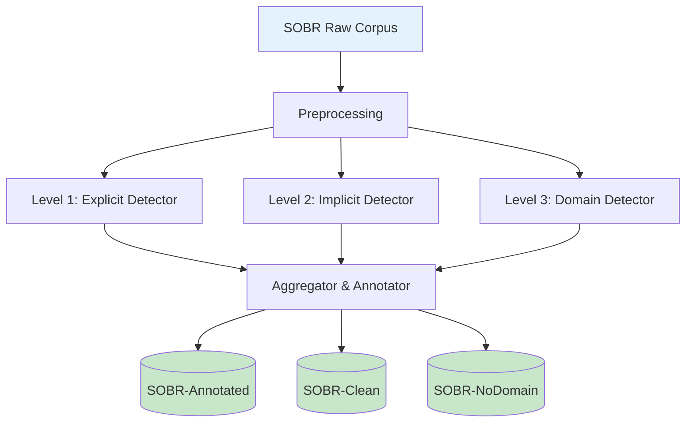
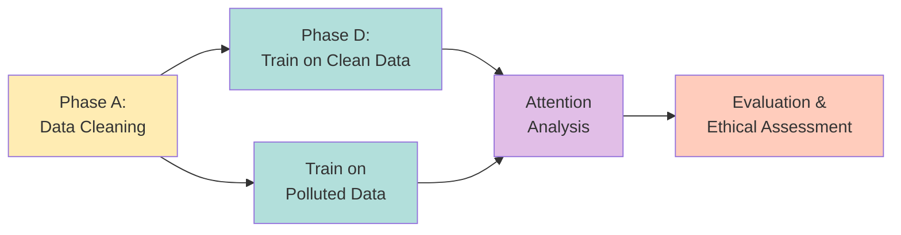
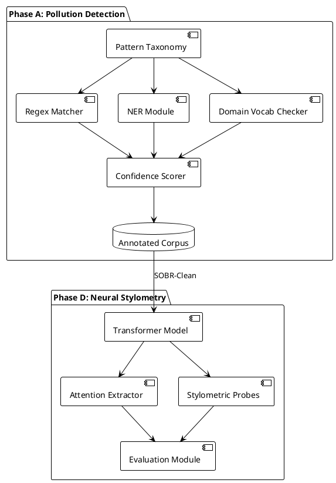
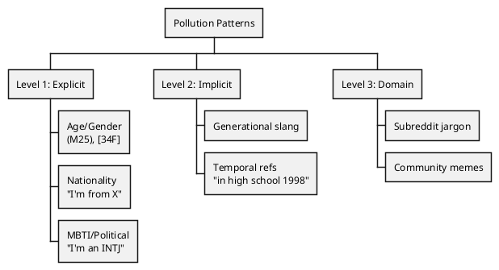

# Research Proposal: Pollution-Aware Stylometric Author Profiling

## 1. Societal and Ethical Motivation

Online platforms increasingly use automated author profiling (e.g., predicting age, gender, or political orientation) for moderation, personalization, and research. However, models trained on polluted data—texts that explicitly reveal these attributes (e.g., "I am a 25-year-old woman from Germany")—risk learning shortcuts instead of genuine writing style. Such systems can:
- Overestimate their ability to infer sensitive traits from style alone,
- Amplify existing demographic and topical biases,
- Encourage problematic uses of profiling in surveillance or discrimination.

This project therefore treats data cleaning and transparency as core ethical requirements: before building any powerful neural model, we must first understand and mitigate the ways in which explicit self-reports and community-specific jargon drive performance. Only then can we honestly assess what stylometric author profiling can (and cannot) do, and discuss its appropriate societal use.

## 2. Research Question and Objectives

**Main Research Question (societal first)**  
*To what extent can we build an author profiling system that (a) avoids relying on explicit self-reports and community-specific shortcuts and (b) instead bases its decisions on more stable, stylistic writing patterns, while remaining transparent about its limitations and risks?*

To answer this, the project pursues two tightly coupled objectives:
1. **Data Pollution Detection and Mitigation (Foundation)**: Detect and annotate texts where author attributes are directly or indirectly revealed, and construct cleaned dataset variants that remove or redact these signals.
2. **Attention-Based Stylometric Feature Extraction (Analysis)**: Train a Transformer-based classifier on the cleaned data and analyze its attention patterns to understand which parts of the text it uses as stylometric evidence.

## 3. Background and Related Work (Brief)

The SOBR corpus (Emmery et al., 2024) shows that self-reports and subreddit-specific jargon heavily influence author profiling results. Earlier distant-supervision pipelines (Beller et al., 2014; Emmery et al., 2017) rely on explicit self-report patterns, while more recent work on cross-domain profiling (Kramp et al., 2023) highlights the risk of domain shortcuts. Studies on Transformer attention (e.g., Clark et al., 2019; Vig & Belinkov, 2019; Rogers et al., 2020) provide tools to inspect which tokens models focus on. This proposal combines these strands: (1) making pollution visible and controllable, and (2) using attention analysis to diagnose whether models still exploit residual shortcut signals.

## 4. Data and Experimental Setup

- **Data**: SOBR Reddit-based author profiling corpus (age, gender, nationality, personality type, political orientation).  
- **Pollution Types**: (a) Level 1 explicit self-reports (e.g., age/gender formats, nationality statements, MBTI and political declarations); (b) Level 2 implicit markers (e.g., generational slang, temporal references); (c) Level 3 domain contamination (subreddit-specific jargon and memes).
- **Datasets Produced**:  
  - `SOBR-Annotated`: original posts with per-span pollution annotations and confidence scores,  
  - `SOBR-Clean`: posts where polluted spans are removed or redacted,  
  - `SOBR-NoDomain`: subset excluding highly domain-specific posts.

## 5. Methodology

### 5.1 Phase A: Data Pollution Detection and Mitigation

1. **Pattern Taxonomy and Rules**: Define a hierarchical taxonomy of pollution patterns (regex for self-reports, lists of community terms, simple NER-based nationality/political detection).  
2. **Detection Pipeline**: For each post, apply a preprocessing step (tokenization, normalization), then run multiple detectors in parallel (explicit self-report patterns, implicit markers, domain vocabulary).  
3. **Annotation and Confidence**: For each match, record the attribute, text span, and a simple confidence score based on pattern specificity and context (e.g., first-person statements score higher).  
4. **Corpus Variants**: From these annotations, generate (a) a fully annotated version, (b) a redacted version (replacing polluted spans with a neutral token), and (c) a filtered version excluding heavily domain-specific posts.

### 5.2 Phase D: Attention-Based Stylometric Feature Extraction

1. **Model Training on Clean Data**: Fine-tune a pre-trained Transformer (e.g., RoBERTa) to predict a single author attribute (e.g., age group) using only `SOBR-Clean`.  
2. **Baseline Comparison**: Train the same architecture on the polluted corpus to illustrate how much performance is driven by shortcuts vs. style.  
3. **Attention Analysis**: Inspect attention weights for correctly classified examples: identify which tokens and token types (function words, punctuation, sentence boundaries) attract high attention, and whether these differ between polluted and clean settings.  
4. **Stylometric Feature Probes**: Train simple “probes” (linear classifiers) on model representations to predict classical stylometric indicators (e.g., function-word ratio, average sentence length, type–token ratio). High probe accuracy on the clean model suggests that it has learned genuine stylistic signals.

## 6. Evaluation and Expected Contributions

- **Metrics**: Macro F1 for author attribute classification; precision/recall for pollution detection; comparisons of performance between polluted vs. clean training; qualitative and quantitative attention analyses (e.g., entropy of attention distributions, proportion of attention on function words vs. content words).  
- **Ethical Insight**: A clear, empirically grounded estimate of how much profiling performance depends on explicitly shared demographic information versus inferred style, supporting more responsible interpretations of such systems.  
- **Technical Deliverables**: (1) a documented pollution detection toolkit and annotated SOBR variants, and (2) an attention-based analysis of a Transformer classifier trained on cleaned data, highlighting which heads and token types appear genuinely stylometric.

## 7. Progress and Next Steps

- **Current Status**: Conceptual design completed; existing specifications for the pollution detection pipeline and attention-based analysis are available as technical references.  
- **Immediate Next Steps** (within the course project): (1) implement a minimal but robust set of explicit self-report patterns for one attribute (e.g., age), (2) produce a small annotated and cleaned subset of SOBR, and (3) run a first pilot experiment comparing polluted vs. clean training for that attribute.

---

## Appendix: Technical Overview

**Figure 1**: Pollution Detection Pipeline Architecture (Phase A Data Flow)

**Figure 2**: Project Workflow and Phase Dependencies

**Figure 3**: System Architecture (PlantUML Component View)

**Figure 4**: Pollution Pattern Taxonomy (PlantUML WBS)

