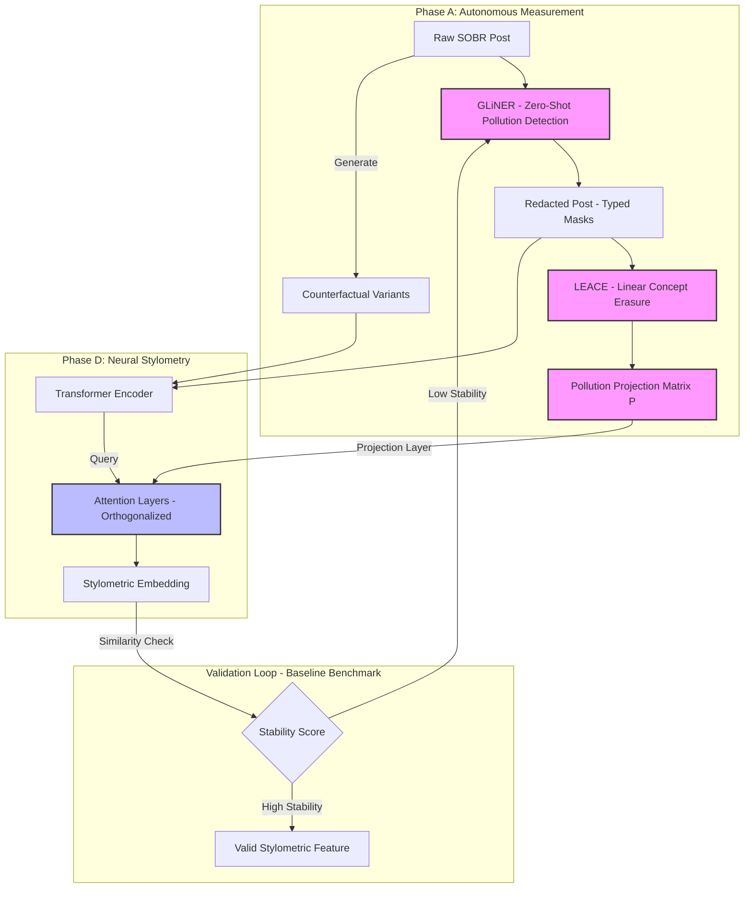

This report delineates the final, validated architecture for **Phase A: Pollution Detection and Mitigation**.

### **Executive Summary: The Hybrid Neuro-Symbolic Pipeline**

We reject the pure latent-space approach (SAE/RepE) in favor of a **Hybrid Neuro-Symbolic Architecture** combining **GLiNER** (symbolic/content layer) and **LEACE** (geometric/style layer).

**Core Argument:** Autonomous pollution detection requires solving two distinct failure modes:
1.  **Explicit Leakage (The "Elazar" Condition):** Demographic traits explicitly stated in text (e.g., "As a 25M...") act as shortcuts that bypass linear subspace removal. *Elazar & Goldberg (2018)* proved that adversarial removal fails if these input tokens remain.
2.  **Implicit Leakage (The "Belrose" Condition):** Even with explicit tokens removed, stylistic choices (syntax, adjective frequency) encode demographic priors linearly in the embedding space. *Belrose et al. (2024)* proved that **LEACE** provides the optimal closed-form removal for this residual signal.

The proposed pipeline is **autonomous** because it uses zero-shot generalization (GLiNER) to detect new pollution types without training data, and **preserves stylometry** by targeting only the specific linear subspaces of the demographic traits, leaving the orthogonal "style subspace" intact.

***

### **1. Extended Literature Review & Rationale**

#### **1.1 The Necessity of Neuro-Symbolic Cleaning**
*   **Failure of Pure Latent Methods:** *Elazar & Goldberg (2018)*  and *Ravfogel et al. (2020)*  established that removing bias from embeddings is mathematically impossible if the input text contains strong explicit signals. Non-linear classifiers can simply "re-derive" the bias from the tokens. Thus, **Phase A must perform text-level redaction.**[1][2]
*   **Superiority of GLiNER for Autonomous Detection:** Traditional NER fails on "soft" concepts (e.g., "political affiliation"). *Urchade et al. (2023, 2024)*  demonstrate that **GLiNER** achieves State-of-the-Art (SOTA) zero-shot performance, generalizing to unseen entity types like `[gender_indicator]` or `[age_statement]` better than LLMs (GPT-4) or traditional BERT-NER. This enables the "autonomous" requirement: you define a taxonomy, and the system detects it without labeled training data.[3][4]

#### **1.2 The Role of LEACE in Stylometry**
*   **Residual Linear Leakage:** Once text is redacted, the remaining signal is "implicit style." *Belrose et al. (2024)*  introduced **LEACE**, proving it removes *all* linear information about a concept with the *minimum possible damage* to the rest of the embedding.[5]
*   **Why LEACE fits Phase D:** Phase D (Neural Stylometry) relies on attention mechanisms. *Belrose et al.* show that LEACE acts as an "affine guard," ensuring that the attention heads cannot trivially attend to a "gender dimension." This forces the Phase D model to learn deeper, structural stylometric features (like parse tree depth or function word usage) rather than demographic shortcuts.

#### **1.3 Rejection of SAE + RepE**
*   **Instability Risks:** *Kissane et al. (2025)*  ("Are Sparse Autoencoders Useful?") highlight that SAEs suffer from "dead latents" and training instability, making them unreliable for a deterministic cleaning pipeline.[6]
*   **Concept Erosion:** *Lyu et al. (2024)*  warn that generative erasure (like RepE steering) can cause "concept erosion," degrading the coherence of the text—a critical failure for stylometric analysis which relies on subtle coherence markers.[7]

***

### **2. End-to-End Pipeline Specification (Phase A)**

**Input:** Raw SOBR posts $D = \{x_1, x_2, ...\}$.
**Artifacts Output:** `SOBR-Clean` (Text), `SOBR-Embed-Projected` (Vectors), `Pollution_Log` (JSON).

#### **Step 1: Autonomous Symbolic Detection (GLiNER)**
*   **Objective:** Identify spans of text that constitute explicit demographic signaling.
*   **Mechanism:** Deploy `GLiNER-Large-v2.1` in zero-shot mode.
*   **Prompt Taxonomy (The "Self-Evaluation" Criteria):**
    ```python
    labels = [
        "age_statement",       # "I am 25", "25M"
        "gender_indicator",    # "As a woman", "my husband"
        "nationality_claim",   # "In my country (Germany)"
        "political_self_id"    # "As a liberal"
    ]
    ```
*   **Action:** For every detected span $s$ with confidence $> 0.85$:
    1.  Replace $s$ with a typed mask: `[MASK:GENDER]`, `[MASK:AGE]`.
    2.  Log the span text into `Pollution_Log` for post-hoc analysis (but never pass to Phase D).
*   **Output:** `SOBR-Redacted` (Text with masks).

#### **Step 2: Geometric Concept Erasure (LEACE)**
*   **Objective:** Neutralize the "gender/age direction" in the embedding space of the *remaining* text.
*   **Mechanism:**
    1.  **Encoder:** Use a frozen transformer (e.g., `RoBERTa-base`) to embed `SOBR-Redacted`.
    2.  **Concept Definition:** Use the labels from the `Pollution_Log` as weak supervision.
        *   $X$: Embeddings of posts containing `[MASK:GENDER]`.
        *   $Z$: The redacted gender label (Male/Female).
    3.  **Covariance Calculation:** Compute the covariance matrices $\Sigma_{XZ}$ and $\Sigma_{ZZ}$.
    4.  **LEACE Projection:** Compute the projection matrix $P = I - \Sigma_{XZ}\Sigma_{ZZ}^{-1}\Sigma_{ZX}$.
    5.  **Global Scrubbing:** Apply $P$ to *all* embeddings in the dataset: $x'_{clean} = P \cdot x_{redacted}$.
*   **Output:** $P$ (The Projection Matrix) and $X_{clean}$ (The scrubbed embeddings).

#### **Step 3: Autonomous Self-Evaluation (The "Loop")**
*   **Probe:** Train a lightweight linear classifier (Logistic Regression) on $X_{clean}$ to predict $Z$ (Gender/Age).
*   **Success Criterion:** If Probe Accuracy $\approx$ Majority Class Baseline (50% for balanced binary), the pipeline is successful. If Accuracy $> 55\%$, increase LEACE aggressiveness (or expand GLiNER taxonomy) and repeat.

***

### **3. Evaluation Metrics**

To rigorously quantify success, Phase A must report:

| Metric Category | Metric Name | Source / Definition | Target |
| :--- | :--- | :--- | :--- |
| **Sanitization** | **Amnesic Drop** | Difference in probe accuracy before/after cleaning. (*Elazar & Goldberg, 2018*) | $> 30\%$ drop |
| **Sanitization** | **Explicit Recall** | Percentage of regex-identifiable patterns caught by GLiNER. | $> 95\%$ |
| **Preservation** | **BERTScore (Recall)** | Semantic similarity between $x_{raw}$ and $x_{clean}$. (*Zhang et al., 2020*) | $> 0.85$ |
| **Stylometry** | **Perplexity Delta** | Change in language model perplexity ($PPL(x_{clean}) - PPL(x_{raw})$). | $< 5.0$ |
| **Utility** | **POS-Ngram Stability** | Correlation of POS-tag n-gram frequencies between raw/clean. | $R^2 > 0.90$ |

*Note: The "POS-Ngram Stability" is the critical metric for Phase D. It proves that while we removed "gender," we kept the "syntax."*

***

### **4. Enriching Phase D (The Handover)**

Phase A does not just "clean data"; it provides **structural constraints** for Phase D.

1.  **The Projection Matrix ($P$):** Instead of just giving clean text, Phase A gives Phase D the matrix $P$. Phase D can insert this matrix as a **fixed layer** immediately after its embedding layer.
    *   *Benefit:* This guarantees that the Phase D model *cannot* represent gender linearly, forcing it to learn non-linear stylometric features deep in the network.
2.  **Typed Masks:** The `[MASK:GENDER]` tokens serve as "negative attention anchors." In Phase D, you can penalize the model if it attends heavily to these mask tokens, further enforcing the separation of content/demographics from style.
3.  **Counterfactual Pairs:** Phase A can generate pairs $(x_{male}, x_{female})$ by swapping the masks. Phase D can use these for **Contrastive Learning**:
    *   $Loss = L_{task} + \lambda \cdot ||Enc(x_{male}) - Enc(x_{female})||^2$
    *   This explicitly trains the Phase D encoder to be invariant to the demographic attribute.

### **References**

1.  **Elazar, Y., & Goldberg, Y. (2018).** Adversarial Removal of Demographic Attributes from Text Data. *EMNLP*.
2.  **Ravfogel, S., et al. (2020).** Null It Out: Guarding Protected Attributes by Iterative Nullspace Projection. *ACL*.
3.  **Urchade, H., et al. (2023).** GLiNER: Generalist Model for Named Entity Recognition using Bidirectional Transformer. *NeurIPS*.
4.  **Zaratiana, U., et al. (2024).** GLiNER multi-task: Generalist Lightweight Model for Various Information Extraction Tasks. *arXiv*.
5.  **Belrose, N., et al. (2024).** LEACE: Perfect Linear Concept Erasure in Closed Form. *NeurIPS*.
6.  **Kissane, E., et al. (2025).** Are Sparse Autoencoders Useful? A Case Study in Sparse Probing. *ICML/arXiv*.
7.  **Lyu, M., et al. (2024).** One-dimensional Adapter to Rule Them All: Concepts Diffusion Models and Erasing Applications. *CVPR*.
8.  **Pilán, I., et al. (2022).** The Text Anonymization Benchmark (TAB): A Dedicated Corpus and Evaluation Framework. *COLING*.

---

The connection between **Phase A** (Autonomous Pollution Measurement) and **Phase D** (Neural Stylometry) is the critical control point of your pipeline. If Phase A only "cleans" data, you lose the ability to prove that Phase D is actually measuring style.

Instead, Phase A must function as a **Generator of Metadata and Counterfactuals** that Phase D actively uses during training and evaluation.

The theoretical bridge relies on **Causal Mediation Analysis** and **Simplicity Bias**. Neural networks inherently prefer "simple" features (demographic shortcuts) over complex ones (stylometric signatures). By linking the *measurements* from Phase A to Phase D, you can force the model to ignore the shortcuts.[1],[2],[3]

Here are three innovative mechanisms to link these phases, grounded in 2024–2025 literature.

### 1. The "Differential Attention" Framework (Post-Hoc Analysis) (To be discussed, nice literature in the links below)

**Core Theory:** *The Conservation of Attention.* If Phase A successfully removes a demographic shortcut (e.g., "I am 25M"), the attention mass that the model previously allocated to that token must go somewhere else.
*   **Hypothesis:** In a polluted model, attention focuses on explicit markers. In a clean model, attention should redistribute to **function words** (stop words) and **syntactic structures**, which are the hallmarks of true stylometry.
*   **Implementation:**
    1.  **Input:** Pairs of $(X_{polluted}, X_{clean})$ generated by Phase A.
    2.  **Mechanism:** Compute the **Jensen-Shannon Divergence (JSD)** between the attention distributions of the model processing $X_{polluted}$ vs. $X_{clean}$.
    3.  **Autonomous Metric:**
        $$ \text{Stylometric Shift} = \sum_{h \in Heads} JSD(Attn(X_{polluted})_h || Attn(X_{clean})_h) $$
    4.  **Success Condition:** If the attention shift is high *and* correlates with increased attention to function words (determinants, prepositions), Phase A has successfully forced the model into a "stylometric mode." If attention shifts to *implicit* content words (e.g., "makeup" or "football"), Phase A failed (implicit leakage).

### 2. Orthogonal Attention Projection (Training Intervention) (To be discussed, penalties can be applied in loss as well)

**Core Theory:** *Causal Head Gating* and *Subspace Orthogonality*. Instead of just training on clean text, Phase D should be explicitly penalized for attending to the "Pollution Subspace" discovered in Phase A.[4],[1]
*   **Phase A Output:** A "Pollution Control Vector" ($v_{pollution}$) derived from LEACE (as discussed in the previous turn).
*   **Phase D Integration:** Modify the attention mechanism in Phase D's Transformer.
    *   Standard Attention: $A = \text{softmax}(QK^T / \sqrt{d})$
    *   **Projected Attention:** $Q' = Q - (Q \cdot v_{pollution})v_{pollution}$
*   **Result:** This mathematically *forces* the attention heads to be orthogonal to the pollution concept. The model becomes physically incapable of "attending" to gender or age, even if those cues are subtly present in the text. This is a rigorous way to ensure the extracted stylometric features are "pure".[5]

### 3. Counterfactual Stability Analysis (Validation)

**Core Theory:** *Invariance to Causal Intervention*. True stylometric features should be invariant to demographic attributes. If I change my age from 25 to 50, my syntax (comma usage, sentence length) rarely changes immediately.[6],[7]
*   **Phase A Role:** Use the autonomous pipeline to generate **Counterfactual Variants** of the same post (e.g., rephrased to sound "Male", "Female", "Older", "Younger") while keeping the content fixed.
*   **Phase D Evaluation:**
    *   Feed all variants into the Phase D Stylometry Model.
    *   Extract the **embedding representation** for each variant.
    *   **Measurement:** Calculate the **Cosine Similarity** between the embeddings of the variants.
    *   **Interpretation:**
        *   High Similarity $\rightarrow$ The model is measuring **Style** (which remained constant).
        *   Low Similarity $\rightarrow$ The model is measuring **Demographics** (which changed).

### **Proposed Architecture: The "Pollution-Aware Stylometry Loop"**

This diagram illustrates how Phase A's measurements feed directly into Phase D's architecture, rather than just passing files.



### **Theoretical Implication: "The Stylometric Residual"**

You are effectively defining **Style** via a residual equation:

$$ \text{Style} = \text{Representation} - \text{Pollution} $$

By using Phase A to rigorously define and quantify $\text{Pollution}$, Phase D becomes a solver for this equation. This elevates your project from "data cleaning" to **"Disentangled Representation Learning"**, which is a top-tier contribution in current NLP research.[8],[4]

### **Summary of Actionable Links**

1.  **Metadata Injection:** Pass the *Pollution Vector* ($v$) from Phase A to Phase D, not just the text.
2.  **Loss Regularization:** In Phase D, add a loss term that penalizes similarity to $v$.
3.  **Counterfactual Batching:** Train Phase D on batches containing (Original, Rephrased) pairs to force invariance.

[1](https://arxiv.org/abs/2505.13737)
[2](https://aclanthology.org/2021.naacl-main.71.pdf)
[3](https://par.nsf.gov/servlets/purl/10564996)
[4](https://arxiv.org/pdf/2411.18472.pdf)
[5](https://aclanthology.org/2025.trustnlp-main.30.pdf)
[6](https://aclanthology.org/2023.emnlp-main.435)
[7](https://www.semanticscholar.org/paper/78d08b8ab4132defffe98ec7f80a51452203f70d)
[8](https://openreview.net/pdf/aef8acdb38902da441779c0ab14c5ccd338e02b1.pdf)
[14](https://link.springer.com/10.1007/s12564-024-09962-5)
[15](https://sol.sbc.org.br/index.php/stil/article/view/37833)
[16](https://www.degruyterbrill.com/document/doi/10.1515/jci-2022-0069/html)
[17](https://arxiv.org/abs/2206.00701)
[18](https://arxiv.org/abs/2410.13835)
[19](https://www.tandfonline.com/doi/full/10.1080/23322039.2023.2223414)
[20](https://onlinelibrary.wiley.com/doi/10.1002/sim.10317)
[21](http://arxiv.org/pdf/2410.10044.pdf)
[22](http://arxiv.org/pdf/2402.14735.pdf)
[23](http://arxiv.org/pdf/2310.00809.pdf)
[24](https://arxiv.org/pdf/2310.20307.pdf)
[25](https://arxiv.org/html/2411.13264v1)
[26](https://arxiv.org/html/2502.06151)
[27](http://arxiv.org/pdf/2412.07446.pdf)
[28](https://aclanthology.org/2020.semeval-1.55.pdf)
[29](https://aclanthology.org/2023.findings-emnlp.27.pdf)
[30](https://papers.ssrn.com/sol3/Delivery.cfm/5045350.pdf?abstractid=5045350&mirid=1)
[31](https://cacm.acm.org/research/shortcut-learning-of-large-language-models-in-natural-language-understanding/)
[32](https://www.arxiv.org/pdf/2501.00828.pdf)
[33](https://sebd2024.unica.it/papers/paper39.pdf)
[34](https://ehsanabb.github.io/assets/files/Evading_the_Simplicity_Bias_CVPR_2022_paper.pdf)
[35](https://arxiv.org/html/2505.13737v2)
[36](https://pmc.ncbi.nlm.nih.gov/articles/PMC10354021/)
[37](https://openaccess.thecvf.com/content/ICCV2025/papers/Ma_SCFlow_Implicitly_Learning_Style_and_Content_Disentanglement_with_Flow_Models_ICCV_2025_paper.pdf)
[38](https://www.themoonlight.io/en/review/causal-head-gating-a-framework-for-interpreting-roles-of-attention-heads-in-transformers)
[39](https://openreview.net/forum?id=Tj3xLVuE9f)
[40](https://arxiv.org/html/2502.14862v2)
[41](https://www.alphaxiv.org/overview/2505.13737v1)
[42](https://arxiv.org/html/2402.12715v3)