# Pollution-Aware Stylometric Classification: Technical Specification

| Metadata | Value |
| :--- | :--- |
| **Document Type** | Technical Specification |
| **Version** | 1.0 |
| **Last Updated** | 2025-12-05 |
| **Status** | Draft |
| **Related Documents** | [advanced_project_planning.md](./advanced_project_planning.md), [interim_project_analysis.md](./interim_project_analysis.md), [SOBR.md](../SOBR.md) |

---

## Index

- Index (this section)
- Executive Summary
- Part I: Phase Dependencies and Waterfall Structure
  - 1.1 Phase Overview Diagram
  - 1.2 Critical Path Analysis
  - 1.3 Deliverable Dependencies
- Part II: Phase A — Data Pollution Detection and Mitigation
  - 2.1 Objectives and Requirements
  - 2.2 System Architecture
  - 2.3 Component Specifications
  - 2.4 Implementation Pipeline
  - 2.5 Validation and Testing
  - 2.6 Deliverables and Acceptance Criteria
  - 2.7 Literature Foundation
- Part III: Phase D — Attention-Based Stylometric Feature Extraction
  - 3.1 Objectives and Requirements
  - 3.2 System Architecture
  - 3.3 Component Specifications
  - 3.4 Implementation Pipeline
  - 3.5 Validation and Testing
  - 3.6 Deliverables and Acceptance Criteria
  - 3.7 Literature Foundation
- Part IV: Phase F — Pollution-Aware Transformer Fine-Tuning
  - 4.1 Objectives and Requirements
  - 4.2 System Architecture
  - 4.3 Component Specifications
  - 4.4 Implementation Pipeline
  - 4.5 Validation and Testing
  - 4.6 Deliverables and Acceptance Criteria
  - 4.7 Literature Foundation
- Part V: Integration and End-to-End Workflow
  - 5.1 Complete System Architecture
  - 5.2 Data Flow Specification
  - 5.3 Evaluation Framework
- References

---

## Executive Summary

This document provides a comprehensive technical specification for a three-phase research project addressing data pollution in stylometric author profiling using the SOBR corpus. The specification follows a strict waterfall methodology where each phase produces artifacts required by subsequent phases, ensuring no deviation from the critical path.

**Phase A (Foundation)** establishes the data quality infrastructure through pollution detection, annotation, and corpus cleaning. This phase produces the annotated datasets and detection toolkit required by all downstream work.

**Phase D (Core Model Understanding)** builds upon the cleaned corpus to investigate how Transformer attention mechanisms encode stylometric features. This phase validates that models trained on clean data attend to genuine stylistic signals rather than content-based shortcuts, producing interpretability insights essential for Phase F.

**Phase F (Final Goal)** synthesizes insights from both prior phases to develop pollution-aware training objectives that explicitly discourage shortcut exploitation, producing robust author profiling models resilient to data contamination.

The waterfall structure ensures that each phase's deliverables directly enable the next phase, with no parallel or independent development tracks that could introduce inconsistencies.

---

# Part I: Phase Dependencies and Waterfall Structure

---

## 1.1 Phase Overview Diagram

The following diagram illustrates the strict sequential dependency structure across all three phases:

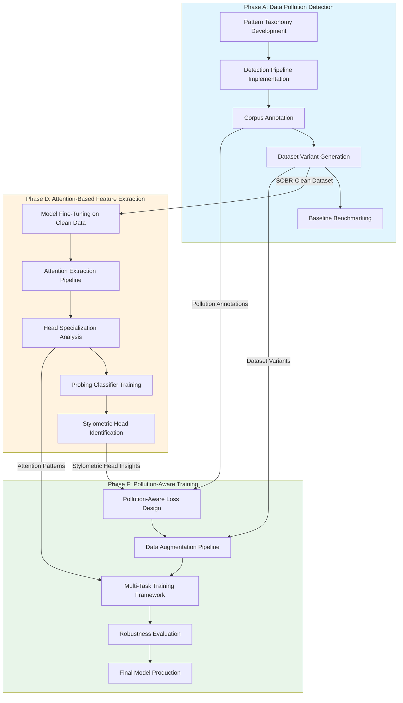

## 1.2 Critical Path Analysis

The following table specifies the critical dependencies between phases, identifying blocking relationships that must be satisfied before subsequent work can commence:

| Upstream Deliverable | Downstream Dependency | Blocking Relationship |
|---------------------|----------------------|----------------------|
| A3: Pollution Annotations | D1: Model Fine-Tuning | Clean training data required |
| A4: SOBR-Clean Dataset | D1: Model Fine-Tuning | Uncontaminated corpus for valid attention analysis |
| A3: Pollution Annotations | F1: Loss Design | Pollution labels for penalty computation |
| A4: Dataset Variants | F2: Augmentation Pipeline | SOBR-Clean and SOBR-Redacted for curriculum training |
| D3: Attention Patterns | F3: Multi-Task Framework | Understanding of what heads encode style vs. content |
| D5: Stylometric Heads | F1: Loss Design | Identification of heads to preserve vs. penalize |

**Critical Path Duration Estimate**:

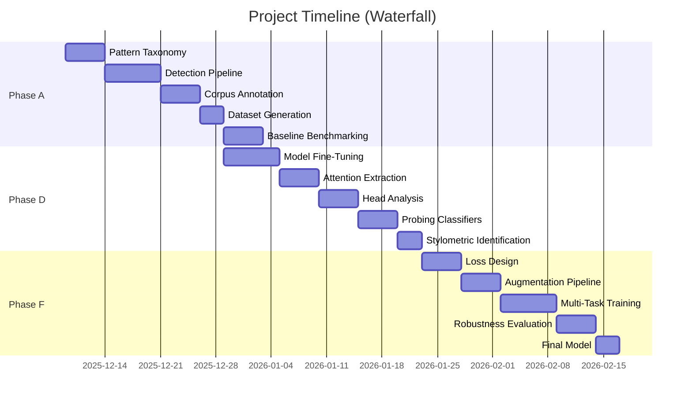

## 1.3 Deliverable Dependencies

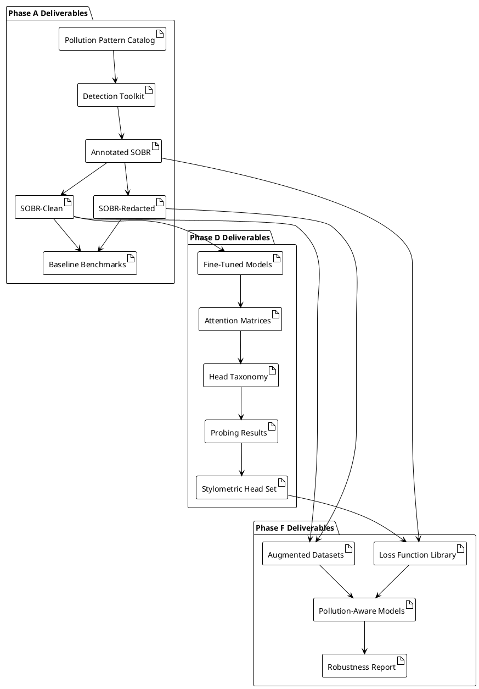

---

# Part II: Phase A — Data Pollution Detection and Mitigation

---

## 2.1 Objectives and Requirements

### 2.1.1 Primary Objectives

| ID | Objective | Success Metric |
|----|-----------|----------------|
| A-OBJ-1 | Develop comprehensive pollution pattern taxonomy | Coverage ≥ 95% of known pollution types |
| A-OBJ-2 | Implement automated detection pipeline | Precision ≥ 85%, Recall ≥ 90% on validation set |
| A-OBJ-3 | Produce annotated SOBR corpus | All posts labeled with pollution flags |
| A-OBJ-4 | Generate clean dataset variants | SOBR-Clean, SOBR-Redacted available |
| A-OBJ-5 | Establish baseline performance bounds | Documented Δ between contaminated and clean |

### 2.1.2 Functional Requirements

| ID | Requirement | Priority |
|----|-------------|----------|
| A-FR-1 | System shall detect Level 1 explicit self-reports (age, gender, nationality, personality, political) | Must |
| A-FR-2 | System shall detect Level 2 implicit attribute markers | Should |
| A-FR-3 | System shall detect Level 3 domain-specific contamination | Should |
| A-FR-4 | System shall annotate posts with pollution type and confidence | Must |
| A-FR-5 | System shall generate multiple corpus variants from annotations | Must |
| A-FR-6 | System shall support incremental processing of large corpus | Must |

### 2.1.3 Non-Functional Requirements

| ID | Requirement | Constraint |
|----|-------------|------------|
| A-NFR-1 | Processing throughput | ≥ 10,000 posts/second |
| A-NFR-2 | Memory footprint | ≤ 16GB RAM for pipeline |
| A-NFR-3 | Reproducibility | Deterministic output given same input |
| A-NFR-4 | Extensibility | New patterns addable without code changes |

---

## 2.2 System Architecture

### 2.2.1 High-Level Architecture

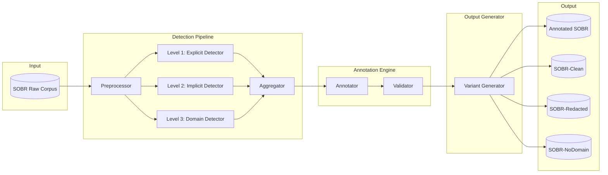

### 2.2.2 Component Interaction Sequence

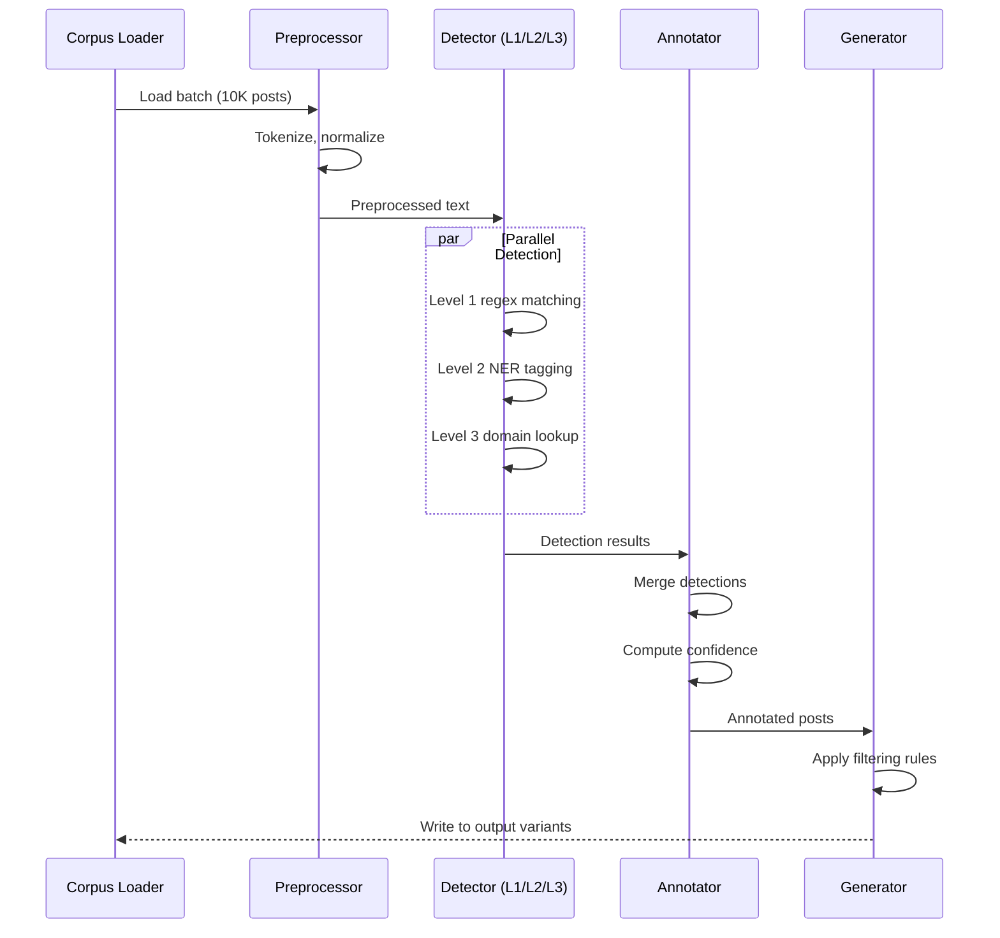

---

## 2.3 Component Specifications

### 2.3.1 Pollution Pattern Taxonomy

The pattern taxonomy is structured hierarchically across three detection levels:

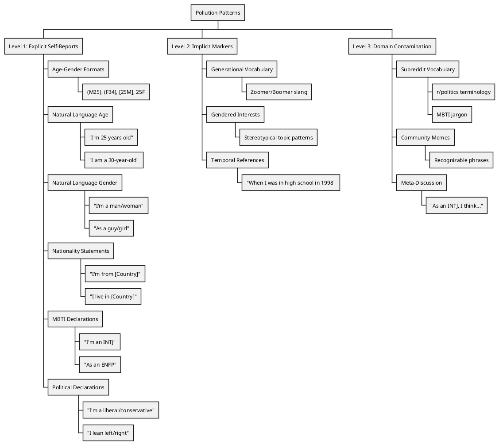

### 2.3.2 Regex Pattern Specifications

| Pattern ID | Attribute | Regex Pattern | Example Matches |
|------------|-----------|---------------|-----------------|
| `AGE_GENDER_PAREN` | Age, Gender | `\(([MmFf])\s*(\d{1,2})\)` | (M25), (f34) |
| `AGE_GENDER_BRACKET` | Age, Gender | `\[(\d{1,2})\s*([MmFf])\]` | [25M], [34f] |
| `AGE_NATURAL` | Age | `[Ii]('m\|'m\| am) (\d{1,2})\s*(y(ear)?s?\s*old)?` | "I'm 25 years old" |
| `GENDER_NATURAL` | Gender | `[Ii]('m\|'m\| am) (a\s+)?(man\|woman\|male\|female\|guy\|girl\|dude\|lady)` | "I'm a woman" |
| `MBTI_DECLARE` | Personality | `[Ii]('m\|'m\| am) (an?\s+)?([EeIi][NnSs][TtFf][JjPp])` | "I'm an INTJ" |
| `POLITICAL_DECLARE` | Political | `[Ii]('m\|'m\| am) (a\s+)?(liberal\|conservative\|leftist\|centrist\|right-wing\|left-wing)` | "I'm a liberal" |
| `NATIONALITY_FROM` | Nationality | `[Ii]('m\|'m\| am) from ([A-Z][a-z]+(?:\s+[A-Z][a-z]+)?)` | "I'm from Germany" |

### 2.3.3 Detection Confidence Scoring

Each detection receives a confidence score based on pattern specificity and context validation:

$$\text{Confidence}(d) = w_{\text{pattern}} \cdot S_{\text{pattern}}(d) + w_{\text{context}} \cdot S_{\text{context}}(d) + w_{\text{position}} \cdot S_{\text{position}}(d)$$

Where:
- $S_{\text{pattern}}(d) \in [0,1]$: Pattern specificity (Level 1 = 1.0, Level 2 = 0.7, Level 3 = 0.5)
- $S_{\text{context}}(d) \in [0,1]$: Contextual validation score (first-person, present tense)
- $S_{\text{position}}(d) \in [0,1]$: Position-based score (parenthetical insertions score higher)
- Weights: $w_{\text{pattern}} = 0.5$, $w_{\text{context}} = 0.3$, $w_{\text{position}} = 0.2$

---

## 2.4 Implementation Pipeline

### 2.4.1 Pipeline State Machine

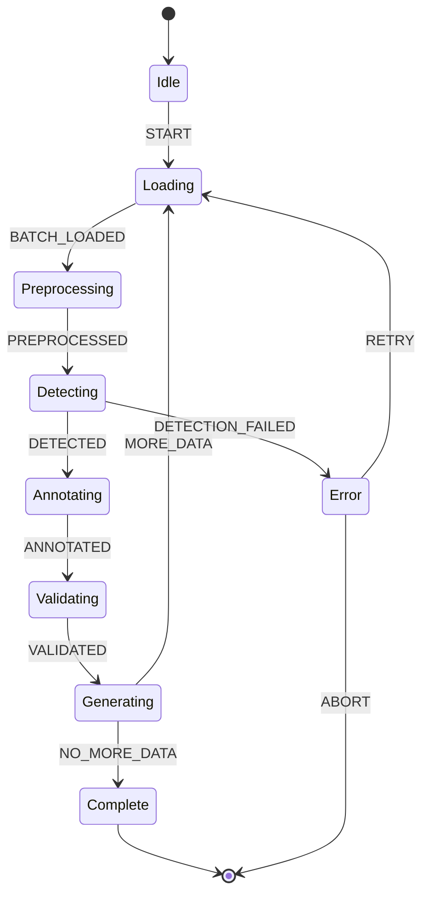

### 2.4.2 Data Flow Specification

```python
# Pseudocode: Core Pipeline Interface

@dataclass
class Post:
    post_id: str
    author_id: str
    text: str
    subreddit: str
    timestamp: datetime
    labels: Dict[str, Any]
    in_domain_flags: Dict[str, bool]

@dataclass
class PollutionAnnotation:
    pattern_id: str
    attribute: str
    span: Tuple[int, int]
    matched_text: str
    confidence: float
    level: int  # 1, 2, or 3

@dataclass
class AnnotatedPost(Post):
    pollution_annotations: List[PollutionAnnotation]
    is_polluted: Dict[str, bool]  # Per attribute
    pollution_score: float  # Aggregate

class DetectionPipeline:
    def __init__(self, config: PipelineConfig):
        self.level1_detector = Level1ExplicitDetector(config.patterns)
        self.level2_detector = Level2ImplicitDetector(config.ner_model)
        self.level3_detector = Level3DomainDetector(config.domain_vocab)
    
    def process_batch(self, posts: List[Post]) -> List[AnnotatedPost]:
        preprocessed = [self.preprocess(p) for p in posts]
        
        # Parallel detection across levels
        l1_results = self.level1_detector.detect_batch(preprocessed)
        l2_results = self.level2_detector.detect_batch(preprocessed)
        l3_results = self.level3_detector.detect_batch(preprocessed)
        
        # Aggregate and annotate
        return self.annotator.merge_and_annotate(
            posts, l1_results, l2_results, l3_results
        )
```

### 2.4.3 Output Schema Specification

```json
{
  "post_id": "string",
  "author_id": "string",
  "text": "string",
  "subreddit": "string",
  "timestamp": "ISO8601",
  "labels": {
    "age": "int | null",
    "gender": "string | null",
    "nationality": "string | null",
    "personality": ["string"] | null,
    "political": "string | null"
  },
  "pollution": {
    "is_polluted": {
      "age": "boolean",
      "gender": "boolean",
      "nationality": "boolean",
      "personality": "boolean",
      "political": "boolean"
    },
    "annotations": [
      {
        "pattern_id": "string",
        "attribute": "string",
        "span": [int, int],
        "matched_text": "string",
        "confidence": "float",
        "level": "int"
      }
    ],
    "aggregate_score": "float"
  },
  "in_domain": {
    "age": "boolean",
    "gender": "boolean",
    "nationality": "boolean",
    "personality": "boolean",
    "political": "boolean"
  }
}
```

---

## 2.5 Validation and Testing

### 2.5.1 Validation Dataset Construction

| Dataset | Size | Purpose | Construction Method |
|---------|------|---------|---------------------|
| `validation_gold` | 500 posts/attribute | Precision/Recall estimation | Manual expert annotation |
| `validation_edge` | 200 posts | Edge case testing | Curated difficult examples |
| `validation_negative` | 500 posts | False positive testing | Posts without self-reports |

### 2.5.2 Evaluation Metrics

**Per-Pattern Metrics**:
$$\text{Precision}_p = \frac{\text{TP}_p}{\text{TP}_p + \text{FP}_p}, \quad \text{Recall}_p = \frac{\text{TP}_p}{\text{TP}_p + \text{FN}_p}$$

**Aggregate Metrics**:
$$\text{Macro-F1} = \frac{1}{|P|} \sum_{p \in P} \frac{2 \cdot \text{Precision}_p \cdot \text{Recall}_p}{\text{Precision}_p + \text{Recall}_p}$$

**Coverage Metric** (Pollution Prevalence Rate):
$$\text{PPR}_a = \frac{|\{d \in D : \text{is\_polluted}(d, a)\}|}{|D|}$$

### 2.5.3 Acceptance Criteria

| Metric | Target | Minimum Acceptable |
|--------|--------|-------------------|
| Level 1 Precision | ≥ 95% | ≥ 90% |
| Level 1 Recall | ≥ 95% | ≥ 90% |
| Level 2 Precision | ≥ 80% | ≥ 70% |
| Level 2 Recall | ≥ 75% | ≥ 65% |
| Processing Speed | ≥ 10K posts/sec | ≥ 5K posts/sec |

---

## 2.6 Deliverables and Acceptance Criteria

| Deliverable | Format | Acceptance Criteria |
|-------------|--------|---------------------|
| **Pollution Pattern Catalog** | Markdown + JSON | All patterns documented with examples |
| **Detection Toolkit** | Python package | Installable, tested, documented |
| **Annotated SOBR** | Parquet files | All posts annotated per schema |
| **SOBR-Clean** | Parquet files | Pollution text removed |
| **SOBR-Redacted** | Parquet files | Pollution replaced with [REDACTED] |
| **SOBR-NoDomain** | Parquet files | In-domain posts excluded |
| **Baseline Benchmarks** | Markdown report | Performance on all variants |

---

## 2.7 Literature Foundation

The following works provide theoretical and methodological foundations for Phase A:

| Reference | Relevance to Phase A |
|-----------|---------------------|
| **Emmery et al. (2024)**: SOBR corpus paper | Defines pollution sources; establishes baseline methodology |
| **Beller et al. (2014)**: Distant labeling via self-reports | Documents self-report patterns exploited by distant supervision |
| **Kramp et al. (2023)**: Cross-domain profiling challenges | Demonstrates in-domain advantage that Phase A must address |
| **Jurafsky & Martin (2024)**: Ch. 2 Regular Expressions | Foundational regex methodology for pattern development |
| **Emmery et al. (2017)**: Twitter author profiling | Earlier distant labeling pipeline; informs pattern design |

---

# Part III: Phase D — Attention-Based Stylometric Feature Extraction

---

## 3.1 Objectives and Requirements

### 3.1.1 Primary Objectives

| ID | Objective | Success Metric |
|----|-----------|----------------|
| D-OBJ-1 | Fine-tune Transformer on SOBR-Clean | Macro-F1 ≥ baseline LR |
| D-OBJ-2 | Extract attention patterns | Attention matrices for all layers/heads |
| D-OBJ-3 | Identify stylometric heads | ≥ 10% of heads classified as stylometric |
| D-OBJ-4 | Validate via probing classifiers | Probing accuracy > random for style features |
| D-OBJ-5 | Produce interpretability insights | Documented attention-feature correlations |

### 3.1.2 Functional Requirements

| ID | Requirement | Priority | Phase A Dependency |
|----|-------------|----------|-------------------|
| D-FR-1 | System shall fine-tune BERT/RoBERTa on SOBR-Clean | Must | A4: SOBR-Clean |
| D-FR-2 | System shall extract attention weights for all inputs | Must | — |
| D-FR-3 | System shall aggregate attention by token type | Must | — |
| D-FR-4 | System shall compute head specialization scores | Must | — |
| D-FR-5 | System shall train probing classifiers on representations | Must | — |
| D-FR-6 | System shall produce visualizations of attention patterns | Should | — |

### 3.1.3 Non-Functional Requirements

| ID | Requirement | Constraint |
|----|-------------|------------|
| D-NFR-1 | GPU memory | ≤ 24GB (single GPU training) |
| D-NFR-2 | Training time | ≤ 48 hours for full fine-tuning |
| D-NFR-3 | Reproducibility | Fixed random seeds, deterministic |

---

## 3.2 System Architecture

### 3.2.1 High-Level Architecture

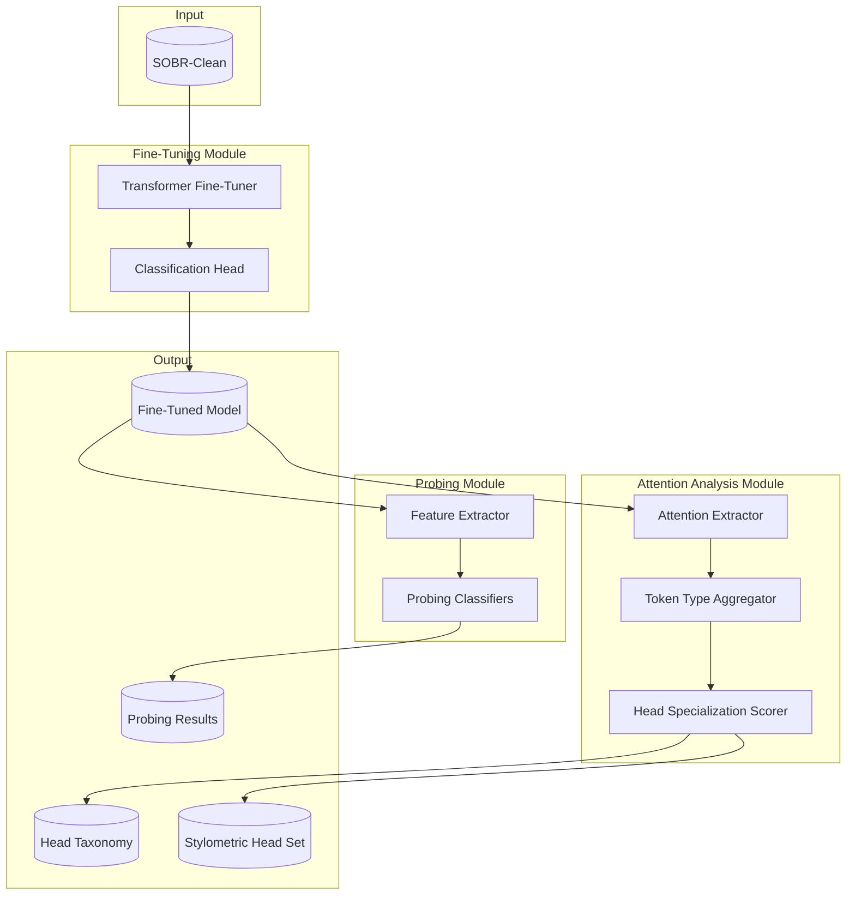

### 3.2.2 Model Architecture Detail

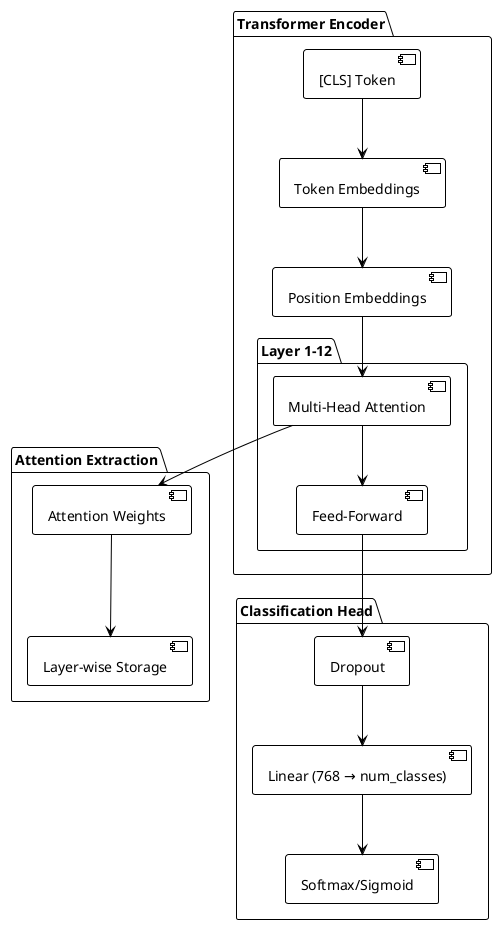

---

## 3.3 Component Specifications

### 3.3.1 Token Type Classification

Tokens are classified into categories for attention aggregation:

| Category | POS Tags | Examples |
|----------|----------|----------|
| `FUNCTION` | DET, PRON, ADP, CONJ, AUX | the, I, of, and, is |
| `CONTENT` | NOUN, VERB, ADJ, ADV | politics, believe, strong, quickly |
| `PUNCT` | PUNCT, SYM | . , ! ? ; : |
| `SPECIAL` | — | [CLS], [SEP], [PAD] |

### 3.3.2 Head Specialization Score Computation

For each attention head $h$ in layer $l$:

**Step 1**: Compute average attention to each token type:
$$\bar{a}_{h,l}^{(c)} = \frac{1}{|T_c|} \sum_{t \in T_c} a_{h,l}([\text{CLS}], t)$$

Where $c \in \{\text{FUNCTION}, \text{CONTENT}, \text{PUNCT}\}$.

**Step 2**: Compute specialization score:
$$S_{h,l} = \frac{\bar{a}_{h,l}^{\text{FUNCTION}} + \bar{a}_{h,l}^{\text{PUNCT}}}{\bar{a}_{h,l}^{\text{CONTENT}} + \epsilon}$$

**Step 3**: Classify heads:
- $S_{h,l} > 1.5$: **Stylometric head** (attends primarily to style)
- $S_{h,l} < 0.67$: **Content head** (attends primarily to content)
- Otherwise: **Mixed head**

### 3.3.3 Probing Classifier Specification

| Probing Target | Input | Architecture | Metric |
|----------------|-------|--------------|--------|
| Function Word Ratio | [CLS] embedding | Linear (768 → 1) | Pearson $r$ |
| Avg. Sentence Length | [CLS] embedding | Linear (768 → 1) | Pearson $r$ |
| Punctuation Density | [CLS] embedding | Linear (768 → 1) | Pearson $r$ |
| Type-Token Ratio | [CLS] embedding | Linear (768 → 1) | Pearson $r$ |
| POS Distribution | [CLS] embedding | Linear (768 → 15) | KL divergence |

---

## 3.4 Implementation Pipeline

### 3.4.1 Training Pipeline

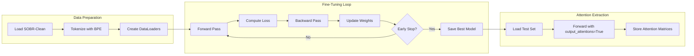

### 3.4.2 Attention Analysis Algorithm

```python
# Pseudocode: Attention Analysis Pipeline

def analyze_attention(model, dataset, tokenizer, pos_tagger):
    """Extract and analyze attention patterns."""
    
    head_scores = defaultdict(list)  # {(layer, head): [scores]}
    
    for batch in dataset:
        # Forward pass with attention
        outputs = model(
            input_ids=batch.input_ids,
            attention_mask=batch.attention_mask,
            output_attentions=True
        )
        
        # Get token types via POS tagging
        token_types = get_token_types(batch, tokenizer, pos_tagger)
        
        for layer_idx, layer_attn in enumerate(outputs.attentions):
            for head_idx in range(layer_attn.shape[1]):
                # Extract [CLS] attention row
                cls_attn = layer_attn[:, head_idx, 0, :]  # (batch, seq)
                
                # Aggregate by token type
                func_attn = aggregate_by_type(cls_attn, token_types, 'FUNCTION')
                cont_attn = aggregate_by_type(cls_attn, token_types, 'CONTENT')
                punct_attn = aggregate_by_type(cls_attn, token_types, 'PUNCT')
                
                # Compute specialization
                score = (func_attn + punct_attn) / (cont_attn + 1e-8)
                head_scores[(layer_idx, head_idx)].append(score)
    
    # Classify heads
    head_taxonomy = classify_heads(head_scores)
    return head_taxonomy
```

---

## 3.5 Validation and Testing

### 3.5.1 Classification Performance Validation

| Attribute | Baseline (LR) | Target (Transformer) |
|-----------|---------------|---------------------|
| Age | 0.548 | ≥ 0.58 |
| Gender | 0.797 | ≥ 0.82 |
| E/I | 0.725 | ≥ 0.75 |
| Nationality | 0.559 | ≥ 0.60 |
| Political | 0.440 | ≥ 0.48 |

### 3.5.2 Attention Analysis Validation

| Validation Check | Method | Expected Outcome |
|-----------------|--------|------------------|
| Attention sums to 1 | Numerical check | All rows sum to 1.0 ± 1e-5 |
| Non-trivial distribution | Entropy check | Entropy > uniform baseline |
| Reproducibility | Multi-run comparison | Head scores variance < 0.05 |

### 3.5.3 Probing Validation

| Requirement | Test | Acceptance |
|-------------|------|------------|
| Style features encoded | Probing accuracy | > 0.3 correlation with ground truth |
| Content not dominant | Content probe | < style probe accuracy |
| Generalizes across domains | Cross-subreddit eval | < 15% performance drop |

---

## 3.6 Deliverables and Acceptance Criteria

| Deliverable | Format | Acceptance Criteria |
|-------------|--------|---------------------|
| **Fine-Tuned Models** | HuggingFace checkpoints | Achieves target F1 on all attributes |
| **Attention Matrices** | NumPy archives | Complete for test set |
| **Head Taxonomy** | JSON + Visualization | All 144 heads classified |
| **Probing Results** | Markdown report | Correlation coefficients reported |
| **Stylometric Head Set** | JSON | List of (layer, head) tuples |

---

## 3.7 Literature Foundation

| Reference | Relevance to Phase D |
|-----------|---------------------|
| **Clark et al. (2019)**: What Does BERT Look At? | Foundational attention analysis methodology |
| **Vig & Belinkov (2019)**: Analyzing attention structure | Head specialization analysis techniques |
| **Rogers et al. (2020)**: A Primer in BERTology | Comprehensive survey of BERT internals |
| **Hay et al. (2020)**: Attention for author profiling | Direct application to stylometry |
| **Hewitt & Manning (2019)**: Structural probe | Probing classifier methodology |

---

# Part IV: Phase F — Pollution-Aware Transformer Fine-Tuning

---

## 4.1 Objectives and Requirements

### 4.1.1 Primary Objectives

| ID | Objective | Success Metric |
|----|-----------|----------------|
| F-OBJ-1 | Design pollution-aware loss functions | Implemented and validated |
| F-OBJ-2 | Develop data augmentation pipeline | Generates polluted/counterfactual examples |
| F-OBJ-3 | Train pollution-resilient models | Counterfactual accuracy ≥ 80% |
| F-OBJ-4 | Achieve robustness to pollution presence | Confidence gap < 5% |
| F-OBJ-5 | Produce production-ready models | Deployable checkpoints |

### 4.1.2 Functional Requirements

| ID | Requirement | Priority | Dependencies |
|----|-------------|----------|--------------|
| F-FR-1 | System shall implement pollution penalty loss | Must | A3: Annotations |
| F-FR-2 | System shall implement consistency loss | Must | A3: Annotations |
| F-FR-3 | System shall generate synthetic pollution | Must | A4: Patterns |
| F-FR-4 | System shall implement counterfactual augmentation | Must | A4: Patterns |
| F-FR-5 | System shall support curriculum training | Should | — |
| F-FR-6 | System shall leverage stylometric head insights | Should | D5: Head Set |

### 4.1.3 Non-Functional Requirements

| ID | Requirement | Constraint |
|----|-------------|------------|
| F-NFR-1 | Training stability | Loss does not diverge |
| F-NFR-2 | Hyperparameter sensitivity | Robust to ±20% λ variation |
| F-NFR-3 | Inference overhead | ≤ 5% slower than baseline |

---

## 4.2 System Architecture

### 4.2.1 High-Level Architecture

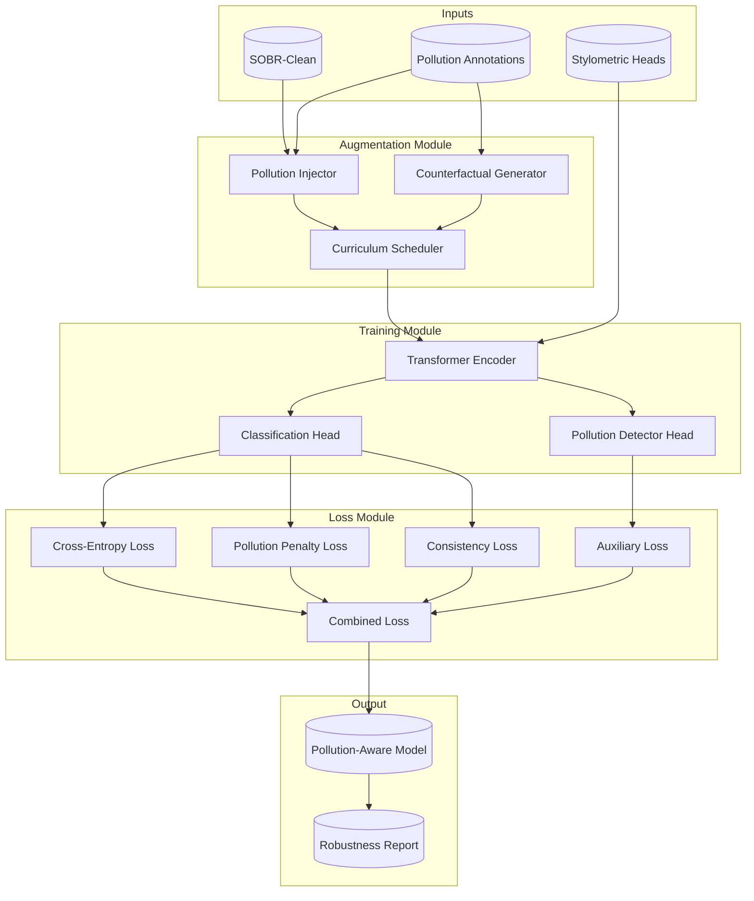

### 4.2.2 Loss Function Architecture

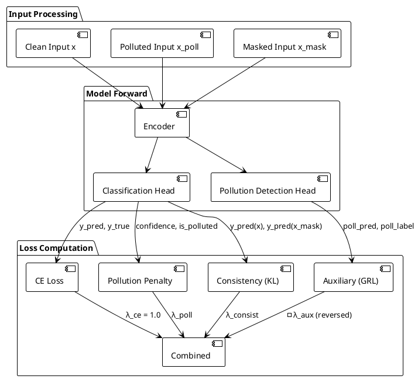

---

## 4.3 Component Specifications

### 4.3.1 Loss Function Specifications

**Cross-Entropy Loss (Baseline)**:
$$\mathcal{L}_{\text{CE}} = -\frac{1}{N} \sum_{i=1}^{N} \sum_{c=1}^{C} y_{i,c} \log \hat{y}_{i,c}$$

**Pollution Penalty Loss**:
$$\mathcal{L}_{\text{poll}} = \frac{1}{N_{\text{poll}}} \sum_{i : \text{polluted}(x_i)} \max(0, \max_c(\hat{y}_{i,c}) - \tau_{\text{poll}})$$

Where $\tau_{\text{poll}} = 0.6$ (confidence threshold).

**Consistency Loss**:
$$\mathcal{L}_{\text{consist}} = \frac{1}{N} \sum_{i=1}^{N} D_{\text{KL}}(\hat{y}(x_i) \| \hat{y}(x_i^{\text{masked}}))$$

Where $x_i^{\text{masked}}$ replaces pollution spans with `[MASK]`.

**Combined Loss**:
$$\mathcal{L}_{\text{total}} = \mathcal{L}_{\text{CE}} + \lambda_{\text{poll}} \mathcal{L}_{\text{poll}} + \lambda_{\text{consist}} \mathcal{L}_{\text{consist}} - \lambda_{\text{aux}} \mathcal{L}_{\text{aux}}$$

**Hyperparameter Defaults**:
| Parameter | Default | Range |
|-----------|---------|-------|
| $\lambda_{\text{poll}}$ | 0.5 | [0.1, 1.0] |
| $\lambda_{\text{consist}}$ | 0.3 | [0.1, 0.5] |
| $\lambda_{\text{aux}}$ | 0.2 | [0.1, 0.3] |
| $\tau_{\text{poll}}$ | 0.6 | [0.5, 0.8] |

### 4.3.2 Data Augmentation Specifications

**Pollution Injection Strategies**:

| Strategy | Description | Implementation |
|----------|-------------|----------------|
| `INJECT_FORMAT` | Add age-gender format | Insert "(M35)" at random position |
| `INJECT_NATURAL` | Add natural language report | Insert "I'm a 35-year-old man" |
| `INJECT_DOMAIN` | Add domain vocabulary | Insert subreddit-specific terms |
| `COUNTERFACTUAL` | Add contradicting pollution | If label=female, inject "(M25)" |

**Curriculum Schedule**:

```mermaid
gantt
    title Curriculum Training Schedule
    dateFormat X
    axisFormat %s
    
    section Pollution Mix
    0% pollution (clean only)     :a1, 0, 3
    10% pollution                 :a2, 3, 6
    30% pollution + counterfactual:a3, 6, 10
```

### 4.3.3 Gradient Reversal Layer

For the auxiliary pollution detection task, gradients are reversed to prevent the encoder from learning to exploit pollution features:

$$\text{GRL}(x) = x \quad (\text{forward})$$
$$\frac{\partial \text{GRL}}{\partial x} = -\lambda_{\text{grl}} I \quad (\text{backward})$$

---

## 4.4 Implementation Pipeline

### 4.4.1 Training Loop

```python
# Pseudocode: Pollution-Aware Training Loop

class PollutionAwareTrainer:
    def __init__(self, model, config, stylometric_heads):
        self.model = model
        self.augmenter = PollutionAugmenter(config.patterns)
        self.curriculum = CurriculumScheduler(config.curriculum)
        self.stylometric_heads = stylometric_heads
        
        # Loss components
        self.ce_loss = CrossEntropyLoss()
        self.poll_loss = PollutionPenaltyLoss(tau=config.tau_poll)
        self.consist_loss = ConsistencyLoss()
        self.aux_loss = AuxiliaryLoss()
        
    def train_epoch(self, epoch, dataloader):
        pollution_ratio = self.curriculum.get_ratio(epoch)
        
        for batch in dataloader:
            # Augment batch
            augmented = self.augmenter.augment(
                batch,
                ratio=pollution_ratio,
                include_counterfactual=(epoch >= 6)
            )
            
            # Forward pass
            outputs = self.model(
                augmented.input_ids,
                augmented.attention_mask,
                output_attentions=True
            )
            
            # Create masked version for consistency
            masked = self.create_masked_version(augmented)
            masked_outputs = self.model(masked.input_ids, masked.attention_mask)
            
            # Compute losses
            loss_ce = self.ce_loss(outputs.logits, augmented.labels)
            loss_poll = self.poll_loss(
                outputs.logits,
                augmented.is_polluted
            )
            loss_consist = self.consist_loss(
                outputs.logits,
                masked_outputs.logits
            )
            loss_aux = self.aux_loss(
                outputs.pollution_logits,
                augmented.pollution_labels
            )
            
            # Combined loss
            loss = (
                loss_ce +
                self.config.lambda_poll * loss_poll +
                self.config.lambda_consist * loss_consist -
                self.config.lambda_aux * loss_aux  # Reversed
            )
            
            # Backward and update
            loss.backward()
            self.optimizer.step()
```

### 4.4.2 Evaluation Pipeline

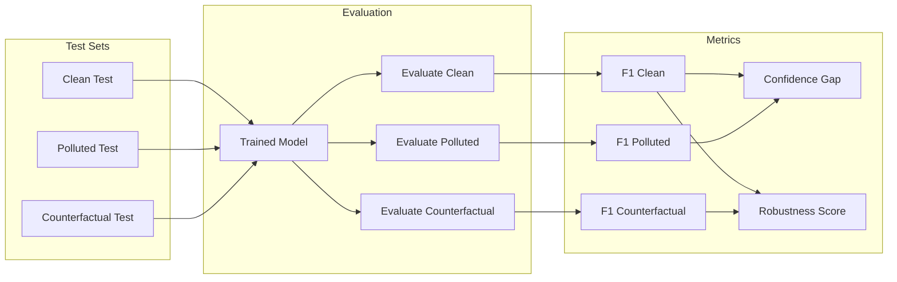

---

## 4.5 Validation and Testing

### 4.5.1 Robustness Metrics

**Confidence Gap**:
$$\text{ConfGap} = \left| \mathbb{E}_{x \in \text{clean}}[\max_c \hat{y}_c] - \mathbb{E}_{x \in \text{polluted}}[\max_c \hat{y}_c] \right|$$

Target: $\text{ConfGap} < 0.05$

**Counterfactual Accuracy**:
$$\text{CF-Acc} = \frac{|\{x : \hat{y}(x_{\text{cf}}) = y_{\text{true}} \}|}{|D_{\text{cf}}|}$$

Target: $\text{CF-Acc} \geq 0.80$ (model ignores contradicting pollution)

**Robustness Score**:
$$\text{Robustness} = 1 - \frac{|\text{F1}_{\text{clean}} - \text{F1}_{\text{polluted}}|}{\text{F1}_{\text{clean}}}$$

Target: $\text{Robustness} \geq 0.95$

### 4.5.2 Ablation Study Design

| Condition | $\mathcal{L}_{\text{CE}}$ | $\mathcal{L}_{\text{poll}}$ | $\mathcal{L}_{\text{consist}}$ | $\mathcal{L}_{\text{aux}}$ | Augmentation |
|-----------|:---:|:---:|:---:|:---:|:---:|
| Baseline | ✓ | ✗ | ✗ | ✗ | ✗ |
| + Penalty | ✓ | ✓ | ✗ | ✗ | ✗ |
| + Consistency | ✓ | ✓ | ✓ | ✗ | ✗ |
| + Auxiliary | ✓ | ✓ | ✓ | ✓ | ✗ |
| + Augmentation | ✓ | ✓ | ✓ | ✓ | ✓ |
| Full (Curriculum) | ✓ | ✓ | ✓ | ✓ | Curriculum |

### 4.5.3 Acceptance Criteria

| Metric | Target | Minimum Acceptable |
|--------|--------|-------------------|
| Clean F1 | ≥ Phase D baseline | ≥ 95% of baseline |
| Polluted F1 | = Clean F1 ± 2% | = Clean F1 ± 5% |
| Counterfactual Accuracy | ≥ 80% | ≥ 70% |
| Confidence Gap | < 5% | < 10% |
| Robustness Score | ≥ 0.95 | ≥ 0.90 |

---

## 4.6 Deliverables and Acceptance Criteria

| Deliverable | Format | Acceptance Criteria |
|-------------|--------|---------------------|
| **Loss Function Library** | Python module | Tested, documented, modular |
| **Augmentation Pipeline** | Python module | Generates all augmentation types |
| **Pollution-Aware Models** | HuggingFace checkpoints | Meets robustness targets |
| **Robustness Report** | Markdown + figures | All metrics documented |
| **Ablation Results** | Tables + analysis | All conditions evaluated |

---

## 4.7 Literature Foundation

| Reference | Relevance to Phase F |
|-----------|---------------------|
| **Utama et al. (2020)**: Debiasing NLU models | Bias mitigation via auxiliary objectives |
| **Clark et al. (2019)**: Ensemble debiasing | Avoiding dataset shortcuts |
| **Sagawa et al. (2020)**: Distributionally robust NNs | Group-shift robustness |
| **Geirhos et al. (2020)**: Shortcut learning | Theoretical framework for pollution exploitation |
| **Ganin et al. (2016)**: Domain-adversarial training | Gradient reversal methodology |
| **Mahabadi et al. (2020)**: End-to-end bias mitigation | Product-of-experts debiasing |

---

# Part V: Integration and End-to-End Workflow

---

## 5.1 Complete System Architecture

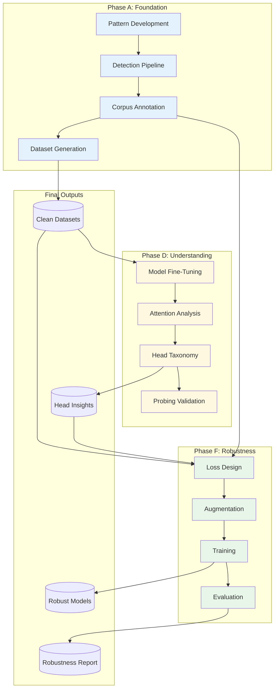

---

## 5.2 Data Flow Specification

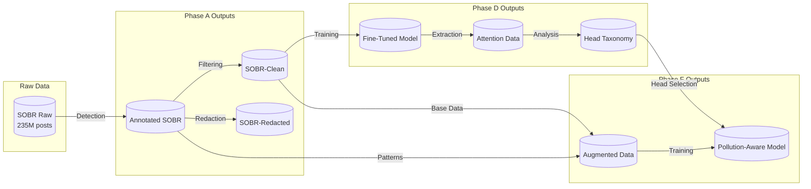

---

## 5.3 Evaluation Framework

### 5.3.1 Cross-Phase Evaluation Matrix

| Metric | Phase A | Phase D | Phase F |
|--------|---------|---------|---------|
| Detection Precision | ★ Primary | — | — |
| Detection Recall | ★ Primary | — | — |
| Classification F1 | Baseline | ★ Primary | ★ Primary |
| Head Specialization | — | ★ Primary | Diagnostic |
| Probing Accuracy | — | ★ Primary | — |
| Confidence Gap | — | — | ★ Primary |
| Counterfactual Accuracy | — | — | ★ Primary |
| Robustness Score | — | — | ★ Primary |

### 5.3.2 Success Criteria Summary

| Phase | Critical Success Metric | Target |
|-------|------------------------|--------|
| A | Level 1 Detection F1 | ≥ 0.92 |
| D | Stylometric Head Identification | ≥ 10% of heads |
| F | Robustness Score | ≥ 0.95 |

---

## References

### Phase A Literature

1. Emmery, C., Miotto, M., Kramp, S., & Kleinberg, B. (2024). SOBR: A corpus for stylometry, obfuscation, and bias on Reddit. *LREC-COLING 2024*.

2. Beller, C., Knowles, R., Harman, C., Bergsma, S., Mitchell, M., & Van Durme, B. (2014). I'm a belieber: Social roles via self-identification and conceptual attributes. *ACL 2014*.

3. Kramp, S., Emmery, C., & Kleinberg, B. (2023). Same author or just same topic? Towards content-independent style representations. *EMNLP 2023*.

4. Jurafsky, D., & Martin, J. H. (2024). *Speech and Language Processing* (3rd ed.). Chapter 2: Regular Expressions.

### Phase D Literature

5. Clark, K., Khandelwal, U., Levy, O., & Manning, C. D. (2019). What does BERT look at? An analysis of BERT's attention. *BlackboxNLP 2019*.

6. Vig, J., & Belinkov, Y. (2019). Analyzing the structure of attention in a Transformer language model. *BlackboxNLP 2019*.

7. Rogers, A., Kovaleva, O., & Rumshisky, A. (2020). A primer in BERTology: What we know about how BERT works. *TACL*.

8. Hay, S., et al. (2020). Representation and classification of author attributes via attention-based neural networks. *Author Profiling*.

### Phase F Literature

9. Utama, P. A., Moosavi, N. S., & Gurevych, I. (2020). Mind the trade-off: Debiasing NLU models without degrading the in-distribution performance. *ACL 2020*.

10. Clark, C., Yatskar, M., & Zettlemoyer, L. (2019). Don't take the easy way out: Ensemble based methods for avoiding known dataset biases. *EMNLP 2019*.

11. Sagawa, S., Koh, P. W., Hashimoto, T. B., & Liang, P. (2020). Distributionally robust neural networks for group shifts. *ICLR 2020*.

12. Ganin, Y., Ustinova, E., Ajakan, H., Germain, P., Larochelle, H., Laviolette, F., ... & Lempitsky, V. (2016). Domain-adversarial training of neural networks. *JMLR*.

13. Geirhos, R., Jacobsen, J. H., Michaelis, C., Zemel, R., Brendel, W., Bethge, M., & Wichmann, F. A. (2020). Shortcut learning in deep neural networks. *Nature Machine Intelligence*.

---

*Document generated: 2025-12-05*
