# Notion Scraper - Architecture Document

> **Design Philosophy:** Reactive Event-Driven Micro-Kernel  
> **Version:** 3.0 | November 30, 2025

---

## 1. System Overview

The Notion Scraper creates offline replicas of Notion sites through a **Master-Worker** distributed architecture. The Master orchestrates; Workers execute.

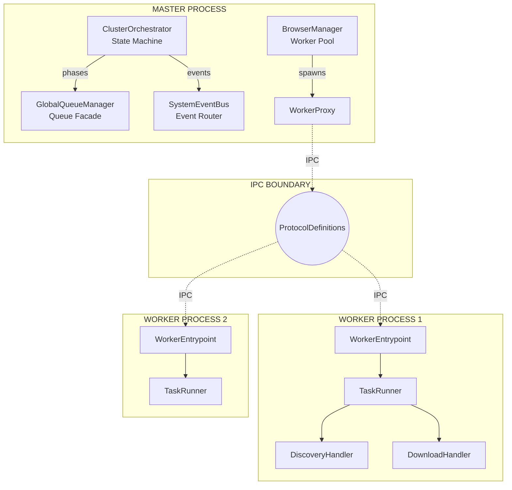

### Core Principles

| Principle | Description |
|-----------|-------------|
| **Master = Brain** | Decides what to do, tracks state, never does heavy work |
| **Worker = Muscle** | Executes tasks, stateless, isolated Puppeteer instance |
| **Event-Driven** | Components communicate via events, not polling |
| **Two-Phase** | Discovery (map site) → Download (save pages) |
| **BFS Traversal** | Breadth-first ensures proper hierarchy |

---

## 2. Communication Contracts

### 2.1 IPC Protocol (`ProtocolDefinitions.js`)

All Master↔Worker communication uses typed messages:

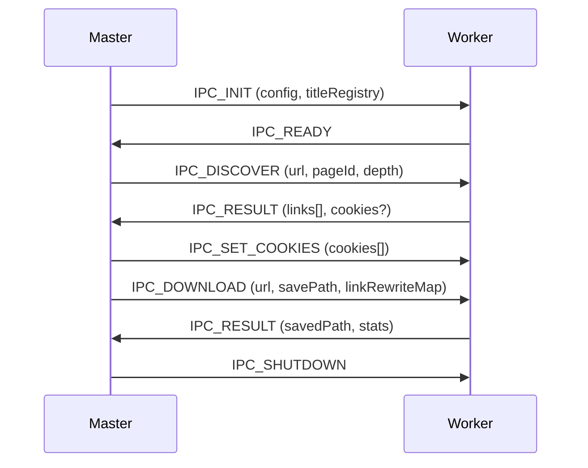

**Message Types:**
- `IPC_INIT` / `IPC_READY` — Worker initialization
- `IPC_DISCOVER` / `IPC_DOWNLOAD` — Task commands
- `IPC_RESULT` — Task completion (success or error)
- `IPC_SET_COOKIES` — Cookie broadcast
- `IPC_SHUTDOWN` — Graceful termination

### 2.2 EventBus Events (`SystemEventBus.js`)

Master-side coordination (never crosses IPC boundary):

| Event | Emitter | Consumer |
|-------|---------|----------|
| `WORKER:READY` | WorkerProxy | BrowserManager |
| `WORKER:IDLE` | WorkerProxy | DiscoveryPhase, DownloadPhase |
| `TASK:COMPLETE` | WorkerProxy | ClusterOrchestrator |
| `TASK:FAILED` | WorkerProxy | ClusterOrchestrator |
| `DISCOVERY:ALL_IDLE` | DiscoveryQueue | DiscoveryPhase |

---

## 3. Package Structure

```
src/
├── core/           # Shared infrastructure (Config, Logger, EventBus, Protocol)
├── domain/         # Domain models (PageContext, PathStrategies)
├── orchestration/  # Master-side coordination (Orchestrator, Queues, Phases)
├── cluster/        # Worker lifecycle (BrowserManager, WorkerProxy)
├── worker/         # Worker-side execution (TaskRunner, Pipeline)
├── processing/     # Content transformation (ToggleCapture, BlockIDMapper)
├── extraction/     # Content extraction (LinkExtractor, BlockIDExtractor)
├── download/       # Asset downloading (CSS, Files)
└── html/           # DOM abstraction (HtmlFacade)
```

---

## 4. Package Details

### 4.1 Core (`src/core/`)

**Purpose:** Cross-process infrastructure.

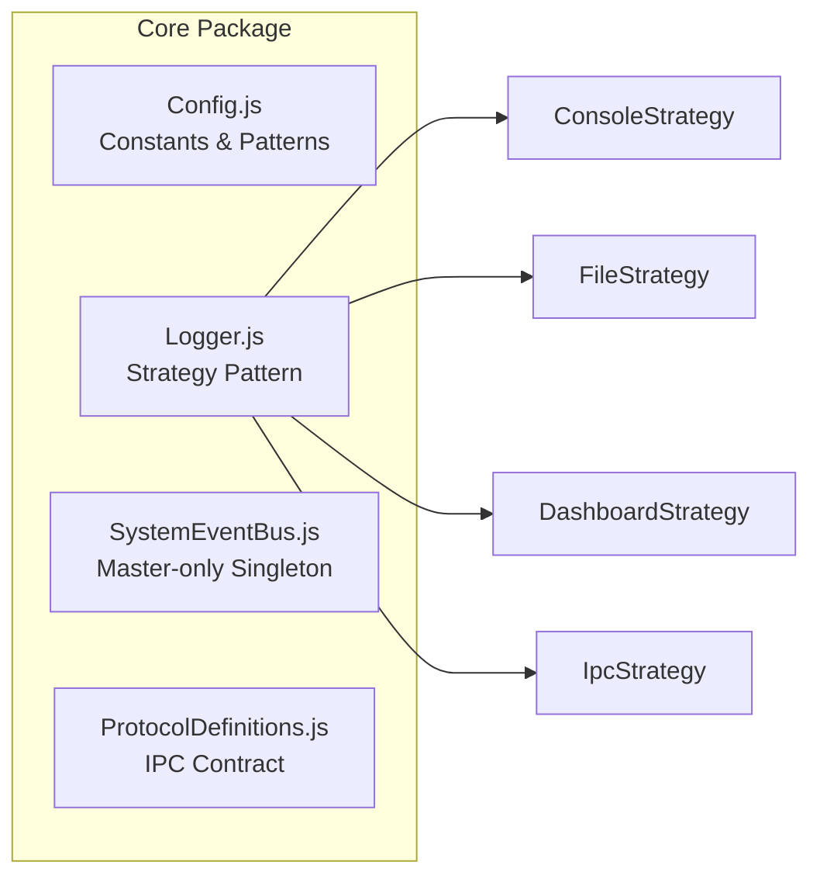

| Module | Concern | Process |
|--------|---------|---------|
| `Config.js` | URLs, timeouts, selectors | Both |
| `Logger.js` | Output routing (strategy pattern) | Both |
| `SystemEventBus.js` | Event pub/sub | **Master only** |
| `ProtocolDefinitions.js` | IPC message types & serialization | Both |

**Invariants:**
- `SystemEventBus` is a singleton, Master-only
- `ProtocolDefinitions` defines ALL valid IPC messages

---

### 4.2 Domain (`src/domain/`)

**Purpose:** Domain models and path computation.

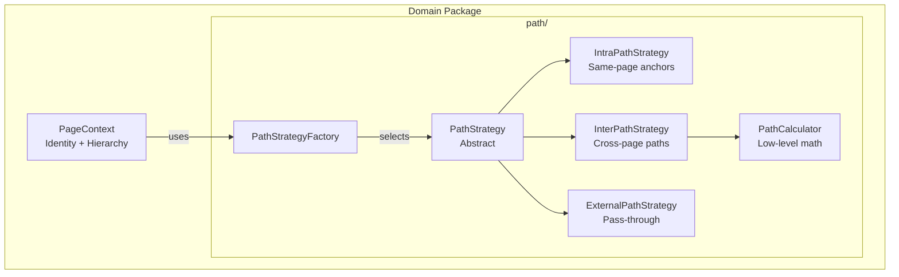

**PageContext** — The core domain model:
- `id`: 32-char Notion page ID
- `title`: Sanitized filename
- `depth`: BFS depth from root
- `parentId`: Parent page reference
- `pathSegments`: Pre-computed path array (survives IPC serialization)

**Path Strategy Pattern:**
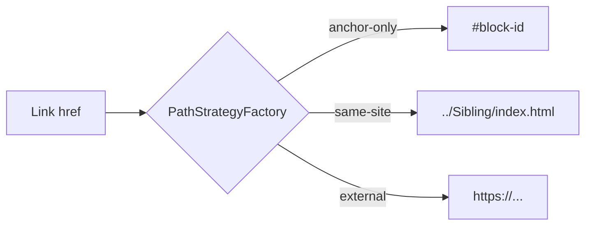

| Strategy | Input | Output |
|----------|-------|--------|
| `IntraPathStrategy` | `#block-id` or same-page link | `#formatted-id` |
| `InterPathStrategy` | Cross-page Notion link | `../Path/index.html` |
| `ExternalPathStrategy` | External URL | Unchanged |

---

### 4.3 Orchestration (`src/orchestration/`)

**Purpose:** Master-side workflow coordination.

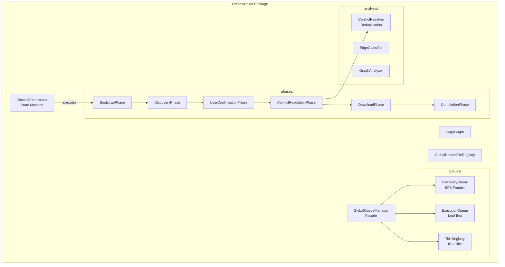

**Workflow Phases:**

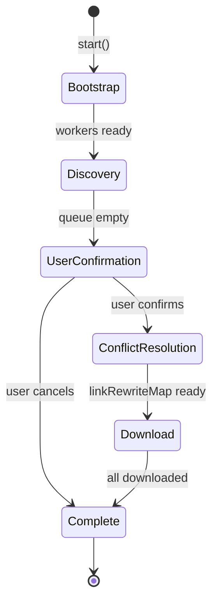

| Phase | Responsibility |
|-------|----------------|
| `BootstrapPhase` | Spawn workers, enqueue root URL |
| `DiscoveryPhase` | BFS traversal, extract links |
| `UserConfirmationPhase` | Display tree, get user approval |
| `ConflictResolutionPhase` | Deduplicate, build `linkRewriteMap` |
| `DownloadPhase` | Parallel page downloads |
| `CompletionPhase` | Cleanup, generate report |

**GlobalQueueManager** — Facade for:
- `DiscoveryQueue`: BFS frontier, tracks visited URLs
- `ExecutionQueue`: Download queue (leaf-first ordering)
- `TitleRegistry`: ID → human-readable title mapping

---

### 4.4 Cluster (`src/cluster/`)

**Purpose:** Worker lifecycle management (Master-side).

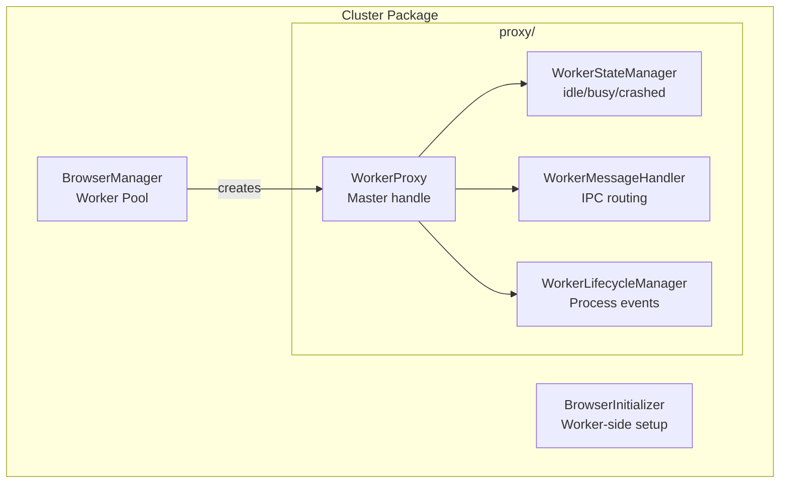

| Module | Process | Concern |
|--------|---------|---------|
| `BrowserManager` | Master | Spawns/terminates workers |
| `WorkerProxy` | Master | IPC handle for one worker |
| `BrowserInitializer` | Worker | Puppeteer browser setup |

**Worker States:**
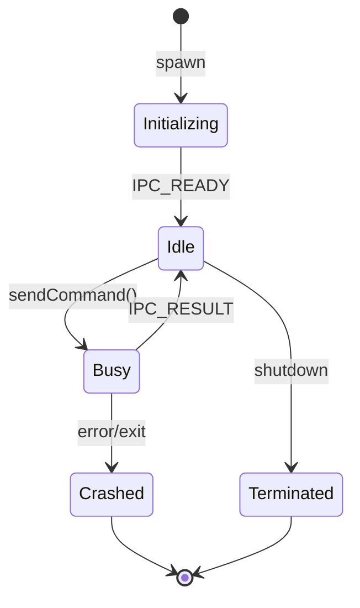

---

### 4.5 Worker (`src/worker/`)

**Purpose:** Task execution inside worker processes.

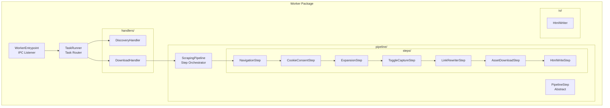

**Pipeline Execution:**

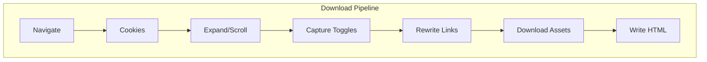

| Step | Concern |
|------|---------|
| `NavigationStep` | Navigate to URL, wait for load |
| `CookieConsentStep` | Dismiss cookie banners |
| `ExpansionStep` | Scroll to trigger lazy loading |
| `ToggleCaptureStep` | Capture collapsed/expanded toggle states |
| `LinkRewriterStep` | Rewrite internal links to local paths |
| `AssetDownloadStep` | Download images, CSS |
| `HtmlWriteStep` | Save final HTML to disk |

---

### 4.6 Processing (`src/processing/`)

**Purpose:** Content transformation utilities.

| Module | Concern |
|--------|---------|
| `ToggleStateCapture` | Capture dual-state toggle HTML |
| `OfflineToggleController` | Generate runtime JS for toggles |
| `BlockIDMapper` | Format raw IDs to UUID anchors |
| `ContentExpander` | Expand toggles during scraping |
| `CookieHandler` | Cookie consent automation |

**Toggle Capture Flow:**
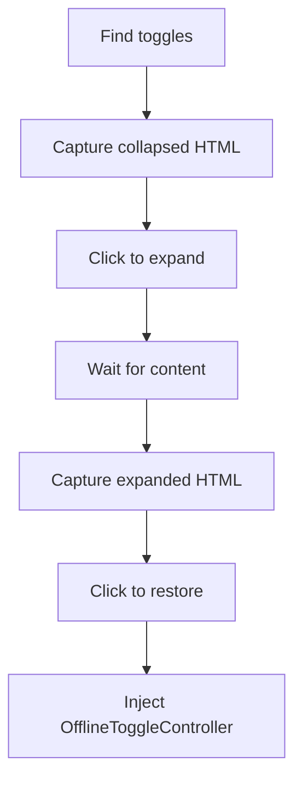

---

### 4.7 Extraction (`src/extraction/`)

**Purpose:** Content extraction from live pages.

| Module | Concern |
|--------|---------|
| `LinkExtractor` | Extract `<a>` links from page |
| `BlockIDExtractor` | Extract `data-block-id` attributes |

Used by `DiscoveryHandler` during discovery phase.

---

### 4.8 Download (`src/download/`)

**Purpose:** Asset downloading.

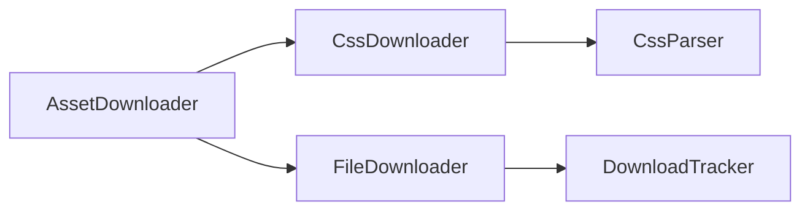

| Module | Concern |
|--------|---------|
| `AssetDownloader` | Coordinate CSS + image downloads |
| `CssDownloader` | Download & rewrite CSS URLs |
| `FileDownloader` | Download individual files |

---

### 4.9 HTML Abstraction (`src/html/`)

**Purpose:** Context-agnostic DOM manipulation.

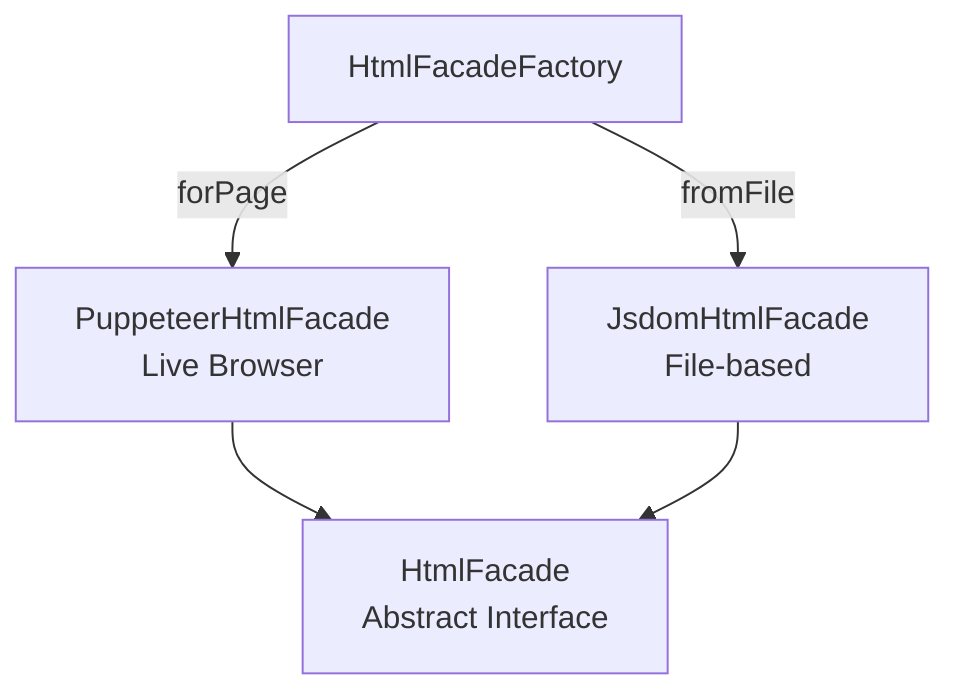

**Design:** Facade pattern enables same code to work with:
- Live Puppeteer pages (download pipeline)
- Saved HTML files (post-processing)

---

## 5. Data Flow

### 5.1 Discovery Phase

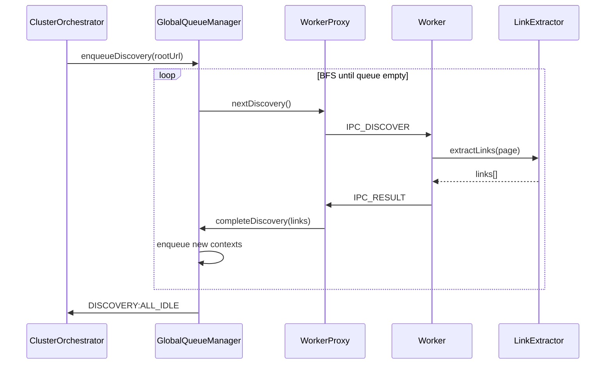

### 5.2 Download Phase

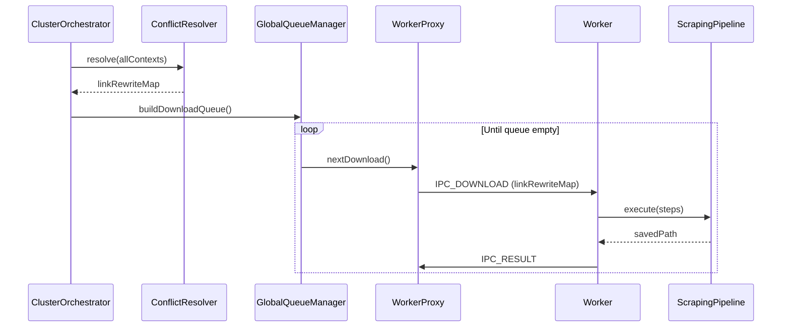

---

## 6. Key Design Decisions

### 6.1 Why PathStrategyFactory?

Link rewriting requires different logic for:
- **Same-page anchors**: `#block-id` (no navigation)
- **Cross-page links**: `../Sibling/index.html` (relative path)
- **External URLs**: Unchanged

The Strategy Pattern encapsulates each case:

```javascript
// PathStrategyFactory selects strategy based on context
const path = factory.resolvePath(sourceContext, targetContext, { targetHref });
// Returns: "#anchor" | "../path/index.html" | "https://..."
```

### 6.2 Why Pre-computed pathSegments?

`PageContext.pathSegments` stores the path hierarchy as an array:
```javascript
// For page at depth 2: Lab_Session_1/
pathSegments = ['JBC090_Language_AI', 'Lab_Session_1']
```

**Reason:** Parent context references are lost during IPC serialization. Pre-computing segments at construction ensures correct path calculation in workers.

### 6.3 Why Two Queues?

| Queue | Purpose | Ordering |
|-------|---------|----------|
| `DiscoveryQueue` | BFS traversal | FIFO (breadth-first) |
| `ExecutionQueue` | Downloads | Leaf-first (children before parents) |

Leaf-first ordering prevents deadlocks when parent pages reference child assets.

### 6.4 Why HtmlFacade?

Same rewriting logic must work in two contexts:
1. **Live page** (Puppeteer) — during download pipeline
2. **Saved file** (JSDOM) — during post-processing

`HtmlFacade` abstracts DOM operations, enabling code reuse.

---

## 7. Invariants & Constraints

### Master Process
- ❌ No Puppeteer browser instances
- ❌ No HTML parsing
- ❌ No heavy computation
- ✅ State management only
- ✅ Event coordination only

### Worker Process
- ❌ No knowledge of other workers
- ❌ No access to global queue
- ❌ No direct Master communication (IPC only)
- ✅ Stateless task execution
- ✅ Isolated browser instance

### IPC Protocol
- All messages must have `type` from `MESSAGE_TYPES`
- Errors must be serialized via `serializeError()`
- Maps must be serialized via `serializeTitleMap()`

### Path Resolution
- **All link rewriting MUST use `PathStrategyFactory`**
- `linkRewriteMap` stores target paths, not source-relative paths
- Workers must compute source-relative paths at rewrite time

---

## 8. File Reference

| Concern | Primary File |
|---------|--------------|
| Entry point | `main-cluster.js` |
| State machine | `ClusterOrchestrator.js` |
| Queue management | `GlobalQueueManager.js` |
| Worker spawning | `BrowserManager.js` |
| Worker execution | `TaskRunner.js` |
| Download pipeline | `ScrapingPipeline.js` |
| Path resolution | `PathStrategyFactory.js` |
| Link rewriting | `LinkRewriterStep.js` |
| Toggle capture | `ToggleStateCapture.js` |
| DOM abstraction | `HtmlFacade.js` |

---

## 9. Extension Points

| Extension | Where to Add |
|-----------|--------------|
| New IPC message | `ProtocolDefinitions.js` |
| New workflow phase | `src/orchestration/phases/` |
| New pipeline step | `src/worker/pipeline/steps/` |
| New path strategy | `src/domain/path/` |
| New log output | `src/core/logger/` |

---

*Document Version: 3.0*  
*Lines: ~650*
